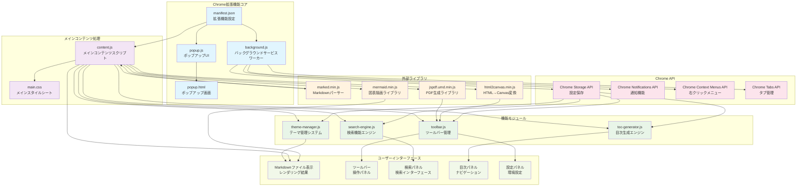

# システム全体のアーキテクチャ図 - Markdown Viewer with Mermaid Chrome拡張機能

## アーキテクチャ概要

### 1. Chrome拡張機能コア
- **manifest.json**: 拡張機能の設定と権限定義
- **background.js**: インストール処理、通知管理、コンテキストメニュー管理
- **popup.js/popup.html**: ポップアップUIとファイルアクセス状態確認

### 2. メインコンテンツ処理
- **content.js**: Markdownファイル検出、初期化、各機能モジュールの統合
- **main.css**: 全体的なスタイリングとテーマベースの外観定義

### 3. 機能モジュール（プラグイン式設計）
- **toolbar.js**: フローティングツールバー、エクスポート機能、キーボードショートカット
- **toc-generator.js**: 見出し抽出、階層構造生成、スムーズスクロール
- **search-engine.js**: 正規表現検索、リアルタイム検索、ハイライト表示
- **theme-manager.js**: ライト/ダーク/セピアテーマ、カスタムCSS適用

### 4. 外部ライブラリ統合
- **marked**: Markdown→HTML変換
- **mermaid**: 図表レンダリング
- **jsPDF**: PDF生成
- **html2canvas**: スクリーンショット機能

### 5. Chrome API活用
- Storage API: ユーザー設定の永続化
- Notifications API: インストール/更新通知
- Context Menus API: 右クリックメニュー拡張
- Tabs API: 新しいタブでのガイド表示

### 6. ユーザーインターフェース
- モジュラー設計による柔軟なUI構成
- レスポンシブデザイン対応
- ドラッグ可能なパネル配置