# クラス図 - Markdown Viewer with Mermaid Chrome拡張機能のJavaScriptクラス

```mermaid
classDiagram
    %% メインコントローラー
    class ContentScript {
        -isInitialized: boolean
        -fileAccessChecker: FileAccessChecker
        -toolbar: Toolbar
        -tocGenerator: TOCGenerator
        -searchEngine: SearchEngine
        -themeManager: ThemeManager
        +initMarkdownViewer(): void
        +checkMarkdownFile(): boolean
        +renderMarkdown(): void
        +setupMermaid(): void
        +handleFileAccess(): void
    }

    %% ツールバークラス
    class Toolbar {
        -container: Element
        -toolbar: Element
        -buttons: MapStringElement
        -isDragging: boolean
        -position: Any
        -shortcuts: Any
        +constructor(container: Element)
        +init(): void
        +createToolbar(): void
        +addButton(id: string, config: Any): Element
        +handleExport(type: string): void
        +handlePrint(): void
        +toggleSettings(): void
        +setupKeyboardShortcuts(): void
        +makeDraggable(): void
        +savePosition(): void
    }

    %% 目次生成クラス
    class TOCGenerator {
        -container: Element
        -tocPanel: Element
        -headings: NodeList
        -currentHeading: Element
        -options: Any
        +constructor(options: Any)
        +init(): void
        +generateTOC(): void
        +createTOCStructure(): Element
        +findHeadings(): NodeList
        +createTOCItem(heading: Element, level: number): Element
        +updateActiveHeading(): void
        +scrollToHeading(id: string): void
        +toggle(): void
        +show(): void
        +hide(): void
        +handleScroll(): void
    }

    %% 検索エンジンクラス
    class SearchEngine {
        -container: Element
        -searchPanel: Element
        -searchInput: Element
        -resultCounter: Element
        -currentResults: Array
        -currentIndex: number
        -highlighter: TextHighlighter
        +constructor(container: Element)
        +init(): void
        +show(): void
        +hide(): void
        +search(query: string, options: Any): void
        +highlightResults(): void
        +clearHighlights(): void
        +navigateResults(direction: string): void
        +updateResultCounter(): void
        +setupKeyboardShortcuts(): void
        +handleRegexSearch(pattern: string): Array
        +handleTextSearch(text: string): Array
    }

    %% テーマ管理クラス
    class ThemeManager {
        -themes: MapStringAny
        -currentTheme: string
        -customCSS: string
        -systemQuery: MediaQuery
        -observers: SetAny
        +constructor()
        +init(): void
        +applyTheme(themeName: string): Promise
        +getCurrentTheme(): string
        +setCustomCSS(css: string): Promise
        +addObserver(callback: Function): void
        +removeObserver(callback: Function): void
        +handleSystemThemeChange(): void
        +updateMermaidTheme(): void
        +saveThemeSettings(): void
        +loadThemeSettings(): Promise
    }

    %% ユーティリティクラス
    class FileAccessChecker {
        +checkFileAccess(): void
        +isAllowedFileSchemeAccess(): boolean
        +showAccessDeniedDialog(): void
    }

    class FileAccessNotifier {
        -isDialogShown: boolean
        +show(): void
        +hide(): void
        +createDialog(): Element
        +handleOpenSettings(): void
    }

    class TextHighlighter {
        -highlightClass: string
        -currentHighlights: Array
        +highlight(element: Element, query: string, options: Any): Array
        +clearHighlights(element: Element): void
        +createHighlightSpan(text: string): Element
        +isValidTextNode(node: Node): boolean
    }

    %% エクスポート関連クラス
    class PDFExporter {
        -options: Any
        +export(element: Element, filename: string): Promise
        +configurePage(): Any
        +addHeader(): void
        +addFooter(): void
        +handleImages(): Promise
    }

    class HTMLExporter {
        -template: string
        +export(content: Element, filename: string): void
        +generateHTML(content: Element): string
        +inlineCSS(): string
        +createDownloadLink(html: string, filename: string): void
    }

    %% 関係性定義（標準記法）
    ContentScript o-- Toolbar : has
    ContentScript o-- TOCGenerator : has
    ContentScript o-- SearchEngine : has
    ContentScript o-- ThemeManager : has
    ContentScript ..> FileAccessChecker : uses

    Toolbar ..> PDFExporter : uses
    Toolbar ..> HTMLExporter : uses
    Toolbar ..> FileAccessNotifier : uses

    SearchEngine ..> TextHighlighter : uses

    TOCGenerator ..> ThemeManager : observes
    SearchEngine ..> ThemeManager : observes
    Toolbar ..> ThemeManager : observes

    FileAccessChecker ..> FileAccessNotifier : creates

    %% 外部ライブラリとの関係
    class MarkedLibrary {
        +parse(markdown: string): string
        +setOptions(options: Any): void
    }

    class MermaidLibrary {
        +initialize(config: Any): void
        +render(definition: string): PromiseString
        +run(): void
    }

    ContentScript ..> MarkedLibrary : uses
    ContentScript ..> MermaidLibrary : uses
    ThemeManager ..> MermaidLibrary : configures

    %% ノート
    note for ContentScript "メインエントリーポイント\nMarkdownファイル検出と\n各モジュールの初期化を担当"
    note for ThemeManager "観察者パターンを実装\nテーマ変更を他のモジュールに通知"
    note for SearchEngine "DOM構造を壊さない\n安全な検索実装"
```

## クラス設計の特徴

### 1. メインコントローラーパターン
- **ContentScript**: 全体の初期化と調整を担当
- 各機能モジュールを統合して協調動作を実現

### 2. プラグイン式アーキテクチャ
- 各機能クラスは独立性を保持
- 疎結合設計により保守性を確保

### 3. 観察者パターンの活用
- **ThemeManager**: テーマ変更を他のモジュールに通知
- 各モジュールが自身の表示を適切に更新

### 4. 責任の分離
- **Toolbar**: UI操作とイベント処理
- **TOCGenerator**: 見出し解析とナビゲーション
- **SearchEngine**: 検索ロジックとハイライト
- **ThemeManager**: 外観とスタイル管理

### 5. ユーティリティクラス
- 共通機能を再利用可能な形で実装
- 単一責任原則に基づく設計

### 6. 外部ライブラリとの統合
- ライブラリの機能をラップして使用
- バージョン変更に対する耐性を確保