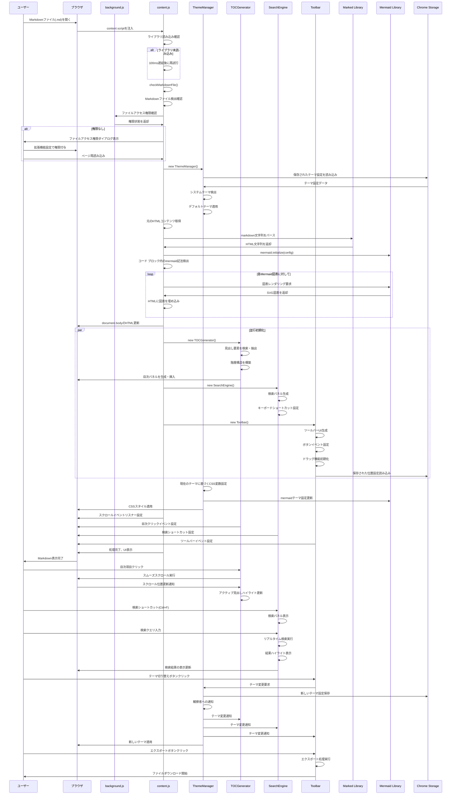

# シーケンス図 - Markdownファイル読み込みから表示までの処理フロー

## 処理フローの詳細説明

### 1. 初期化フェーズ (Initialization Phase)
- **ライブラリ検証**: 必要な外部ライブラリの読み込み確認
- **権限チェック**: ファイルアクセス権限の確認と必要に応じたダイアログ表示
- **環境準備**: テーマ設定の読み込みとシステム環境の検出

### 2. コンテンツ処理フェーズ (Content Processing Phase)
- **Markdown パース**: Marked ライブラリを使用したHTML変換
- **Mermaid レンダリング**: 図表の検出と SVG 変換
- **DOM 更新**: 処理済みコンテンツでページ内容を置換

### 3. 機能モジュール初期化フェーズ (Module Initialization Phase)
- **並行初期化**: 各機能モジュールの独立初期化
- **UI 構築**: ユーザーインターフェース要素の生成と配置
- **イベント設定**: ユーザー操作に対応するイベントリスナーの設定

### 4. 動的操作フェーズ (Dynamic Operation Phase)
- **リアルタイム応答**: ユーザー操作に対する即座の反応
- **状態管理**: 各モジュール間での状態同期
- **永続化**: ユーザー設定の Chrome Storage への保存

### 5. テーマ管理の観察者パターン
- **中央管理**: ThemeManager による一元的なテーマ制御
- **通知配信**: 全モジュールへの変更通知
- **一貫性確保**: UI 全体でのテーマ統一性維持