# フロー図 - ユーザーMarkdownファイル操作から拡張機能動作までの流れ

```mermaid
flowchart TD
    Start([ユーザーがMarkdownファイルを開く]) --> FileCheck{ファイル形式チェック}
    
    FileCheck -->|.md/.mkd/.mdx/.markdown| ExtensionTrigger[Chrome拡張機能トリガー]
    FileCheck -->|その他の形式| End([通常のファイル表示])
    
    ExtensionTrigger --> ScriptInjection[content.js注入]
    ScriptInjection --> LibCheck{外部ライブラリ確認}
    
    LibCheck -->|未読み込み| LibWait[100ms待機]
    LibWait --> LibCheck
    LibCheck -->|読み込み完了| AccessCheck{ファイルアクセス権限確認}
    
    AccessCheck -->|権限あり| InitProcess[初期化処理開始]
    AccessCheck -->|権限なし| AccessDialog[ファイルアクセス権限ダイアログ表示]
    
    AccessDialog --> UserAction{ユーザー操作}
    UserAction -->|設定を開く| ExtensionSettings[Chrome拡張機能設定画面]
    UserAction -->|後で設定| LimitedMode[制限モード動作]
    UserAction -->|キャンセル| End
    
    ExtensionSettings --> PermissionGrant[ファイルアクセス権限付与]
    PermissionGrant --> PageReload[ページ再読み込み]
    PageReload --> InitProcess
    
    InitProcess --> ThemeInit[テーママネージャー初期化]
    ThemeInit --> StorageRead[保存設定読み込み]
    StorageRead --> SystemTheme[システムテーマ検出]
    SystemTheme --> ThemeApply[デフォルトテーマ適用]
    
    ThemeApply --> ContentProcess[コンテンツ処理開始]
    ContentProcess --> OriginalContent[元のHTMLコンテンツ取得]
    OriginalContent --> MarkdownParse[Marked.jsでMarkdownパース]
    
    MarkdownParse --> MermaidCheck{Mermaid図表存在チェック}
    MermaidCheck -->|あり| MermaidInit[Mermaid初期化]
    MermaidCheck -->|なし| HTMLReplace[HTMLコンテンツ置換]
    
    MermaidInit --> MermaidRender[各図表をSVGレンダリング]
    MermaidRender --> HTMLReplace
    
    HTMLReplace --> ModuleInit[機能モジュール並行初期化]
    
    subgraph "並行初期化処理"
        TOCInit[TOCGenerator初期化]
        SearchInit[SearchEngine初期化]
        ToolbarInit[Toolbar初期化]
        
        TOCInit --> HeadingExtract[見出し抽出・階層構築]
        HeadingExtract --> TOCPanel[目次パネル生成]
        
        SearchInit --> SearchPanel[検索パネル生成]
        SearchPanel --> SearchShortcuts[検索ショートカット設定]
        
        ToolbarInit --> ToolbarUI[ツールバーUI生成]
        ToolbarUI --> ButtonEvents[ボタンイベント設定]
        ButtonEvents --> DragSetup[ドラッグ機能設定]
        DragSetup --> PositionLoad[保存位置読み込み]
    end
    
    ModuleInit --> TOCInit
    ModuleInit --> SearchInit
    ModuleInit --> ToolbarInit
    
    TOCPanel --> EventSetup[イベントリスナー設定]
    SearchShortcuts --> EventSetup
    PositionLoad --> EventSetup
    
    EventSetup --> FinalRender[最終レンダリング]
    FinalRender --> UserInterface[ユーザーインターフェース表示完了]
    
    UserInterface --> UserInteraction{ユーザー操作待機}
    
    %% ユーザー操作フロー
    UserInteraction -->|目次クリック| TOCNavigation[目次ナビゲーション]
    UserInteraction -->|検索実行| SearchAction[検索機能実行]
    UserInteraction -->|テーマ変更| ThemeSwitch[テーマ切り替え]
    UserInteraction -->|エクスポート| ExportAction[エクスポート処理]
    UserInteraction -->|印刷| PrintAction[印刷処理]
    UserInteraction -->|設定変更| SettingsPanel[設定パネル表示]
    
    %% 目次ナビゲーション
    TOCNavigation --> ScrollTo[スムーズスクロール実行]
    ScrollTo --> ActiveUpdate[アクティブ見出し更新]
    ActiveUpdate --> UserInteraction
    
    %% 検索機能
    SearchAction --> SearchQuery[検索クエリ処理]
    SearchQuery --> RegexCheck{正規表現検索?}
    RegexCheck -->|はい| RegexSearch[正規表現処理]
    RegexCheck -->|いいえ| TextSearch[テキスト検索]
    
    RegexSearch --> SearchHighlight[検索結果ハイライト]
    TextSearch --> SearchHighlight
    SearchHighlight --> ResultNavigation[結果間ナビゲーション]
    ResultNavigation --> UserInteraction
    
    %% テーマ切り替え
    ThemeSwitch --> ThemeValidate[テーマ選択検証]
    ThemeValidate --> ThemeStorageSave[テーマ設定保存]
    ThemeStorageSave --> ObserverNotify[観察者への通知]
    ObserverNotify --> UIUpdate[UI全体更新]
    UIUpdate --> MermaidThemeUpdate[Mermaid図表テーマ更新]
    MermaidThemeUpdate --> UserInterface
    
    %% エクスポート処理
    ExportAction --> ExportType{エクスポート種類}
    ExportType -->|PDF| PDFExport[PDF生成処理]
    ExportType -->|HTML| HTMLExport[HTMLファイル生成]
    
    PDFExport --> PDFConfig[PDF設定適用]
    PDFConfig --> CanvasRender[HTML2Canvas変換]
    CanvasRender --> PDFGenerate[jsPDFでPDF生成]
    PDFGenerate --> FileDownload[ファイルダウンロード]
    
    HTMLExport --> HTMLTemplate[HTMLテンプレート生成]
    HTMLTemplate --> CSSInline[CSS埋め込み]
    CSSInline --> FileDownload
    
    FileDownload --> UserInteraction
    
    %% 印刷処理
    PrintAction --> PrintCSS[印刷用CSS適用]
    PrintCSS --> PrintDialog[ブラウザ印刷ダイアログ]
    PrintDialog --> UserInteraction
    
    %% 設定パネル
    SettingsPanel --> SettingsUI[設定パネル表示]
    SettingsUI --> SettingsSave[設定変更保存]
    SettingsSave --> UIRefresh[設定反映・UI更新]
    UIRefresh --> UserInteraction
    
    %% 制限モード（権限なし）
    LimitedMode --> LimitedInit[制限付き初期化]
    LimitedInit --> BasicRender[基本表示のみ]
    BasicRender --> LimitedUI[制限付きUI表示]
    LimitedUI --> LimitedInteraction[制限付き操作]
    LimitedInteraction --> LimitedInteraction
    
    %% スタイリング
    classDef startEnd fill:#e8f5e8,stroke:#4caf50,stroke-width:3px
    classDef decision fill:#fff3e0,stroke:#ff9800,stroke-width:2px
    classDef process fill:#e3f2fd,stroke:#2196f3,stroke-width:2px
    classDef userAction fill:#f3e5f5,stroke:#9c27b0,stroke-width:2px
    classDef errorPath fill:#ffebee,stroke:#f44336,stroke-width:2px
    classDef parallelProcess fill:#e0f2f1,stroke:#009688,stroke-width:2px
    
    class Start,End,UserInterface startEnd
    class FileCheck,LibCheck,AccessCheck,UserAction,MermaidCheck,UserInteraction,RegexCheck,ExportType decision
    class ExtensionTrigger,ScriptInjection,InitProcess,ThemeInit,ContentProcess,MarkdownParse,HTMLReplace,EventSetup,FinalRender process
    class AccessDialog,ExtensionSettings,PermissionGrant,PageReload,TOCNavigation,SearchAction,ThemeSwitch,ExportAction,PrintAction,SettingsPanel userAction
    class LimitedMode,LimitedInit,BasicRender,LimitedUI,LimitedInteraction errorPath
    class TOCInit,SearchInit,ToolbarInit,HeadingExtract,TOCPanel,SearchPanel,SearchShortcuts,ToolbarUI,ButtonEvents,DragSetup,PositionLoad parallelProcess
```

## ユーザーフローの主要ポイント

### 1. 入口検証フェーズ
- **ファイル形式チェック**: 対応するMarkdown拡張子の確認
- **権限検証**: ファイルアクセス権限の確認と対応
- **ライブラリ確認**: 必要な外部ライブラリの読み込み状態確認

### 2. 初期化フェーズ
- **段階的初期化**: 依存関係を考慮した順序での初期化
- **並行処理**: 独立性のある機能の同時初期化
- **設定復元**: 保存されたユーザー設定の読み込みと適用

### 3. インタラクティブフェーズ  
- **リアルタイム応答**: ユーザー操作に対する即座の反応
- **状態管理**: 操作による状態変更の適切な管理
- **永続化**: 設定変更の Chrome Storage への自動保存

### 4. エラーハンドリング
- **制限モード**: 権限不足時の代替動作
- **グレースフルデグラデーション**: 機能制限での継続動作
- **ユーザーガイダンス**: 問題解決のための案内表示

### 5. パフォーマンス最適化
- **遅延読み込み**: 必要時のみの重い処理実行
- **並行初期化**: CPU使用率の最適化
- **キャッシュ活用**: 繰り返し処理の効率化