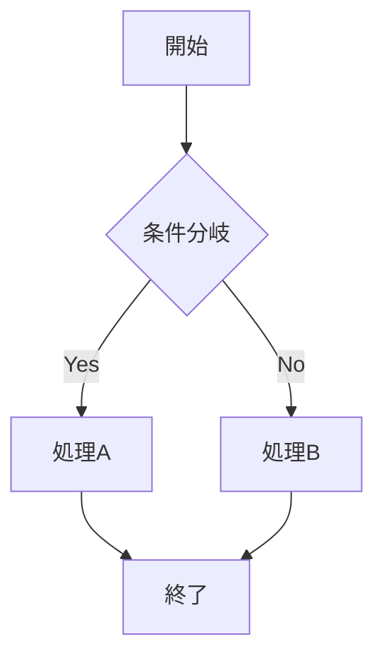

# Enhanced Markdown Viewer ユーザーマニュアル 📖

## 🎯 概要

Enhanced Markdown Viewer は、Chrome拡張機能として動作する高機能なMarkdownビューアーです。基本的なMarkdown表示に加えて、目次生成、テーマ切り替え、検索機能、印刷最適化などの先進的な機能を提供します。

## 🚀 インストール方法

### Chrome拡張機能としてインストール

1. **Chromeブラウザを開く**
2. **拡張機能管理ページにアクセス**
   - アドレスバーに `chrome://extensions/` と入力
   - または Chrome メニュー → その他のツール → 拡張機能
3. **デベロッパーモードを有効化**
   - 右上の「デベロッパーモード」をオンに切り替え
4. **拡張機能を読み込み**
   - 「パッケージ化されていない拡張機能を読み込む」をクリック
   - ダウンロードしたフォルダを選択
5. **インストール完了**
   - 拡張機能一覧に「Markdown Viewer with Mermaid」が表示される

### 初回設定

インストール後、以下の設定を確認してください：

- **ファイルアクセス許可**: 拡張機能の詳細で「ファイルのURLへのアクセスを許可する」をON
- **権限確認**: 必要な権限が正しく設定されていることを確認

## 📝 基本的な使用方法

### Markdownファイルを開く

1. **ファイル準備**
   - `.md` または `.markdown` 拡張子のファイルを準備
2. **ファイルを開く**
   - Chromeで `Ctrl+O` (Windows) または `Cmd+O` (Mac)
   - Markdownファイルを選択して開く
3. **自動変換**
   - 拡張機能が自動的に検出し、美しいHTMLとして表示

### サンプルファイルでテスト

```bash
# 付属のサンプルファイルを使用
sample.md または test-enhanced.html を開いてテスト
```

## 🎨 機能ガイド

### 1. ツールバー

ページ上部に表示されるツールバーから全ての機能にアクセスできます。

#### ツールバーボタン
- **📋 目次**: 目次パネルの表示/非表示
- **🔍 検索**: 検索パネルの表示
- **🎨 テーマ**: テーマ選択ドロップダウン
- **🖨️ 印刷**: 印刷用に最適化
- **⚙️ 設定**: 詳細設定パネル

### 2. 目次機能 (TOC)

#### 基本操作
- **表示切り替え**: `📋 目次` ボタンまたは `Ctrl+T`
- **ナビゲーション**: 目次項目をクリックで該当箇所にジャンプ
- **現在位置表示**: スクロール位置に応じて自動ハイライト

#### 高度な機能
- **階層表示**: h1〜h6の見出し階層を自動認識
- **番号付け**: 自動的に章番号を生成 (1.1.1 形式)
- **折りたたみ**: 階層ごとの表示切り替え
- **スムーススクロール**: 滑らかな画面移動

#### キーボードショートカット
- `Ctrl+↑`: 前の見出しに移動
- `Ctrl+↓`: 次の見出しに移動
- `Ctrl+T`: 目次表示切り替え

### 3. テーマシステム

#### 利用可能なテーマ
- **Light**: 明るい背景、日中の作業に最適
- **Dark**: 暗い背景、夜間作業や目の疲労軽減
- **Sepia**: 温かみのある色調、長時間の読書に適している

#### テーマ切り替え方法
1. **手動切り替え**
   - ツールバーの `🎨` ボタンをクリック
   - ドロップダウンから希望のテーマを選択
2. **自動切り替え**
   - 「自動切り替え」ボタンをクリック
   - システムの明暗設定に自動で追従

#### カスタマイズ
- **カスタムCSS**: 設定パネルで独自のスタイルを追加
- **色調整**: CSS変数を使用した詳細なカスタマイズ可能

### 4. 検索機能

#### 基本検索
1. **検索開始**: `🔍 検索` ボタンまたは `Ctrl+F`
2. **クエリ入力**: 検索ボックスに検索したいテキストを入力
3. **リアルタイム表示**: 入力と同時に結果をハイライト表示

#### 高度な検索オプション
- **大文字小文字区別**: チェックボックスで切り替え
- **正規表現**: 複雑な検索パターンに対応
- **完全一致**: 単語境界での完全一致検索

#### 検索結果ナビゲーション
- **次の結果**: `↓` ボタンまたは `Enter`
- **前の結果**: `↑` ボタンまたは `Shift+Enter`
- **結果表示**: 「2/5」のような形式で現在位置を表示

#### ハイライト機能
- **検索結果**: 黄色背景でハイライト
- **現在の結果**: オレンジ背景で強調表示
- **自動スクロール**: 結果位置に自動で画面移動

### 5. 印刷機能

#### 印刷実行
1. **印刷開始**: `🖨️ 印刷` ボタンまたは `Ctrl+P`
2. **自動最適化**: ツールバーや目次を自動で非表示
3. **レイアウト調整**: 印刷用に最適化されたレイアウトに変更

#### 印刷設定
- **用紙サイズ**: A4サイズに最適化
- **マージン**: 適切な余白設定
- **改ページ**: 見出しや図表での適切な改ページ
- **URL表示**: 外部リンクのURL自動表示

### 6. 設定パネル

#### アクセス方法
- ツールバーの `⚙️ 設定` ボタンをクリック

#### 設定項目
- **表示設定**
  - 目次に番号を表示: ON/OFF
  - スムーススクロール: ON/OFF
- **検索設定**
  - ハイライト色: カラーピッカーで選択
- **カスタムCSS**
  - 独自のCSSスタイルを追加可能

#### 設定の保存
- 設定は自動的にChrome Storage APIで保存
- ブラウザを再起動しても設定が保持される

## 🎮 キーボードショートカット一覧

### 基本操作
| ショートカット | 機能 |
|---------------|------|
| `Ctrl+F` / `Cmd+F` | 検索パネル表示 |
| `Ctrl+P` / `Cmd+P` | 印刷 |
| `Ctrl+T` / `Cmd+T` | 目次表示切り替え |
| `Escape` | パネル・モーダルを閉じる |

### 検索機能
| ショートカット | 機能 |
|---------------|------|
| `Enter` | 次の検索結果 |
| `Shift+Enter` | 前の検索結果 |
| `Escape` | 検索パネルを閉じる |

### ナビゲーション
| ショートカット | 機能 |
|---------------|------|
| `Ctrl+↑` / `Cmd+↑` | 前の見出し |
| `Ctrl+↓` / `Cmd+↓` | 次の見出し |

## 🎯 Mermaid図表機能

### 対応する図表タイプ
- **フローチャート**: 処理の流れを表現
- **シーケンス図**: オブジェクト間の相互作用
- **クラス図**: クラス構造とリレーション
- **ガントチャート**: プロジェクトスケジュール
- **状態図**: システムの状態遷移
- **ER図**: データベース設計
- **パイ/円グラフ**: データの比率表示

### 記述方法
````markdown

````

### テーマ連動
- Markdown全体のテーマに自動で連動
- Light/Dark/Sepiaテーマに対応した図表スタイル

## 🔧 トラブルシューティング

### よくある問題

#### 1. 拡張機能が動作しない
**症状**: Markdownファイルが通常のテキストとして表示される
**解決策**:
- ファイルアクセス権限を確認
- `chrome://extensions/` で拡張機能が有効になっているか確認
- ファイル拡張子が `.md` または `.markdown` であることを確認

#### 2. 目次が表示されない
**症状**: 目次ボタンが無効になっている
**解決策**:
- 文書内に見出し (h1〜h6) があることを確認
- 見出し記法 (`# ## ###`) が正しく記述されているか確認

#### 3. 検索機能が動作しない
**症状**: 検索パネルが表示されない、または検索結果が出ない
**解決策**:
- `Ctrl+F` または検索ボタンで検索パネルを開く
- JavaScript エラーがないかブラウザのコンソールを確認

#### 4. Mermaid図が表示されない
**症状**: Mermaid図がエラー表示またはコードのまま
**解決策**:
- Mermaid記法が正しいか確認
- コードブロックの言語指定が `mermaid` になっているか確認
- 複雑すぎる図の場合、シンプルに変更してテスト

#### 5. テーマが適用されない
**症状**: テーマを変更しても見た目が変わらない
**解決策**:
- ブラウザのキャッシュをクリア
- ページをリロード (`Ctrl+R`)
- カスタムCSSとの競合を確認

### デバッグ方法

#### ブラウザ開発者ツール
1. **コンソール確認**
   - `F12` で開発者ツールを開く
   - Console タブでエラーメッセージを確認
2. **ネットワーク確認**
   - Network タブでリソースの読み込み状況を確認
3. **要素検査**
   - Elements タブでHTML構造とCSS適用状況を確認

#### 設定リセット
```javascript
// ブラウザコンソールで実行
chrome.storage.sync.clear(); // 設定をリセット
location.reload(); // ページをリロード
```

## 📱 レスポンシブ対応

### モバイル・タブレット対応
- **自動調整**: 画面サイズに応じたレイアウト
- **タッチ操作**: タップ・スワイプに対応
- **目次**: スライド式の表示・非表示
- **ツールバー**: コンパクト表示

### 推奨環境
- **デスクトップ**: 1024px以上の画面幅
- **タブレット**: 768px〜1023px
- **スマートフォン**: 767px以下

## 🔒 プライバシーとセキュリティ

### データ保護
- **ローカル保存**: 設定はブラウザ内のみに保存
- **外部送信なし**: ファイル内容は外部に送信されません
- **最小権限**: 必要最小限の権限のみ要求

### セキュリティ機能
- **XSS対策**: ユーザー入力の適切なエスケープ
- **CSP準拠**: Content Security Policy に準拠
- **ファイルアクセス**: ユーザーが明示的に開いたファイルのみアクセス

## 🆘 サポート

### ヘルプリソース
- **テストファイル**: `test-enhanced.html` で機能テスト
- **検証スクリプト**: ブラウザコンソールで `runMarkdownViewerTests()` 実行
- **設計書**: `doc/` フォルダ内の詳細ドキュメント

### フィードバック
機能改善のご提案やバグ報告は、プロジェクトの Issues セクションまでお願いします。

---

**バージョン**: 2.0.0  
**最終更新**: 2025年1月28日  
**対応Chrome**: 90以上

このマニュアルにより、Enhanced Markdown Viewer の全機能を効果的に活用できます。快適なMarkdown閲覧体験をお楽しみください！ ✨