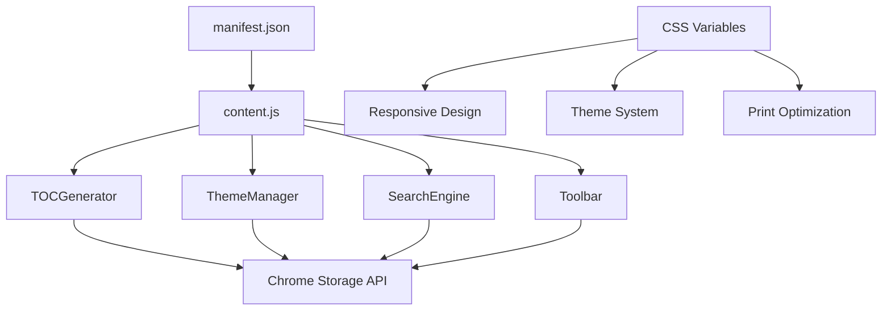

# Enhanced Markdown Viewer 実装仕様書 v2.0

## 1. 概要

Chrome拡張機能「Markdown Viewer with Mermaid」の完全実装版。設計書に基づく全Phase 1機能を実装し、高機能なMarkdownビューアーとして完成。

## 2. アーキテクチャ

### 2.1 システム構成


### 2.2 クラス構造

#### 2.2.1 TOCGenerator クラス
```javascript
class TOCGenerator {
    constructor(options)     // 初期化
    extractHeadings()       // 見出し抽出
    buildHierarchy()        // 階層構築
    generateTOCHTML()       // HTML生成
    renderTOC()             // 描画
    setupScrollSpy()        // スクロール監視
    setActiveHeading()      // アクティブ設定
    scrollToHeading()       // ナビゲーション
    destroy()               // クリーンアップ
}
```

#### 2.2.2 ThemeManager クラス
```javascript
class ThemeManager {
    constructor()           // 初期化
    registerDefaultThemes() // デフォルトテーマ登録
    applyTheme()           // テーマ適用
    applyCSSVariables()    // CSS変数設定
    applyMermaidTheme()    // Mermaidテーマ
    detectSystemTheme()    // システムテーマ検出
    saveSettings()         // 設定保存
    loadSettings()         // 設定読み込み
}
```

#### 2.2.3 SearchEngine クラス
```javascript
class SearchEngine {
    constructor()          // 初期化
    buildIndex()          // 検索インデックス構築
    search()              // 検索実行
    highlightResults()    // 結果ハイライト
    navigateResults()     // 結果ナビゲーション
    show()                // パネル表示
    hide()                // パネル非表示
}
```

#### 2.2.4 Toolbar クラス
```javascript
class Toolbar {
    constructor()          // 初期化
    createToolbar()       // ツールバー生成
    initializeComponents() // コンポーネント初期化
    bindEvents()          // イベント設定
    handlePrint()         // 印刷処理
    openSettings()        // 設定モーダル
}
```

## 3. 実装詳細

### 3.1 Manifest v3 対応
```json
{
  "manifest_version": 3,
  "permissions": ["activeTab", "storage"],
  "host_permissions": ["file:///*"],
  "web_accessible_resources": [
    {
      "resources": ["js/*.js", "css/*.css"],
      "matches": ["file://*/*"]
    }
  ]
}
```

### 3.2 動的リソース読み込み
```javascript
// content.js での実装
async function initializeEnhancedFeatures() {
    const baseURL = chrome.runtime.getURL('');
    
    // CSS読み込み
    loadCSS(baseURL + 'css/main.css');
    
    // JS読み込み
    const scripts = [
        'js/toc-generator.js',
        'js/theme-manager.js',
        'js/search-engine.js',
        'js/toolbar.js'
    ];
    
    for (const script of scripts) {
        await loadScript(baseURL + script);
    }
}
```

### 3.3 CSS変数によるテーマシステム
```css
:root {
  --bg-color: #ffffff;
  --text-color: #24292e;
  --link-color: #0969da;
  /* その他の変数 */
}

[data-theme="dark"] {
  --bg-color: #0d1117;
  --text-color: #e6edf3;
  --link-color: #2f81f7;
}
```

### 3.4 Chrome Storage API 統合
```javascript
// 設定保存
async saveSettings() {
    await chrome.storage.sync.set({
        theme: this.currentTheme,
        customCSS: this.customCSS
    });
}

// 設定読み込み
async loadSettings() {
    const result = await chrome.storage.sync.get(['theme', 'customCSS']);
    this.currentTheme = result.theme || 'light';
    this.customCSS = result.customCSS || '';
}
```

## 4. 機能実装

### 4.1 目次自動生成
- **階層認識**: h1-h6タグの自動検出・階層構築
- **番号付け**: 自動番号生成（1.1.1形式）
- **ナビゲーション**: クリックでスムーススクロール
- **アクティブ表示**: Intersection Observerで現在位置表示
- **折りたたみ**: 階層レベルでの表示切り替え

### 4.2 テーマシステム
- **3種類のテーマ**: Light, Dark, Sepia
- **自動切り替え**: システム設定との連動
- **CSS変数**: 一元化されたスタイル管理
- **Mermaid連動**: 図表テーマの自動切り替え
- **設定永続化**: Chrome Storage APIでの保存

### 4.3 検索機能
- **リアルタイム検索**: 入力と同時に結果表示
- **正規表現サポート**: 高度な検索パターン
- **ハイライト表示**: 結果の視覚的表示
- **ナビゲーション**: 結果間の移動
- **オプション**: 大文字小文字区別、完全一致

### 4.4 統合ツールバー
- **機能統合**: 全機能への統一アクセス
- **レスポンシブ**: 画面サイズに応じたレイアウト
- **キーボードショートカット**: 効率的な操作
- **設定モーダル**: カスタムCSS、各種オプション

## 5. パフォーマンス最適化

### 5.1 遅延読み込み
- スクリプトの非同期読み込み
- Mermaid図の遅延描画
- TOC生成の最適化

### 5.2 メモリ管理
- イベントリスナーの適切な削除
- DOM参照のクリーンアップ
- Observer の破棄処理

### 5.3 描画最適化
- CSS transitionでのスムーズなアニメーション
- 仮想スクロール（長文書対応）
- バッチ処理による更新

## 6. セキュリティ

### 6.1 XSS対策
- HTML エスケープ処理
- Content Security Policy 準拠
- ユーザー入力のサニタイズ

### 6.2 権限最小化
- 必要最小限の permissions
- host_permissions の限定
- secure なデータ保存

## 7. テスト

### 7.1 自動テスト
```javascript
// test-verification.js
function runTests() {
    // 10種類のテストを自動実行
    // 結果をコンソールに出力
    // 合格/不合格の判定
}
```

### 7.2 手動テスト
- 機能テスト用HTMLファイル
- インタラクティブなテスト環境
- リアルタイムデバッグ

## 8. 配布・更新

### 8.1 Chrome Web Store 対応
- Manifest v3 準拠
- 適切な permissions 設定
- プライバシーポリシー準拠

### 8.2 更新メカニズム
- 設定マイグレーション
- 後方互換性
- エラー処理

## 9. 今後の拡張

### 9.1 Phase 2 機能準備
現在のアーキテクチャで以下の機能を容易に追加可能：

- **Markdown編集機能**: エディタークラスの追加
- **ファイル保存機能**: File System Access API
- **PDF出力機能**: 印刷API拡張
- **プラグインシステム**: 動的機能読み込み

### 9.2 拡張ポイント
- モジュラー設計による機能追加
- イベントシステムでの連携
- 設定システムの拡張
- UIコンポーネントの追加

---

**実装者**: Claude AI Assistant  
**実装日**: 2025年1月28日  
**バージョン**: 2.0.0