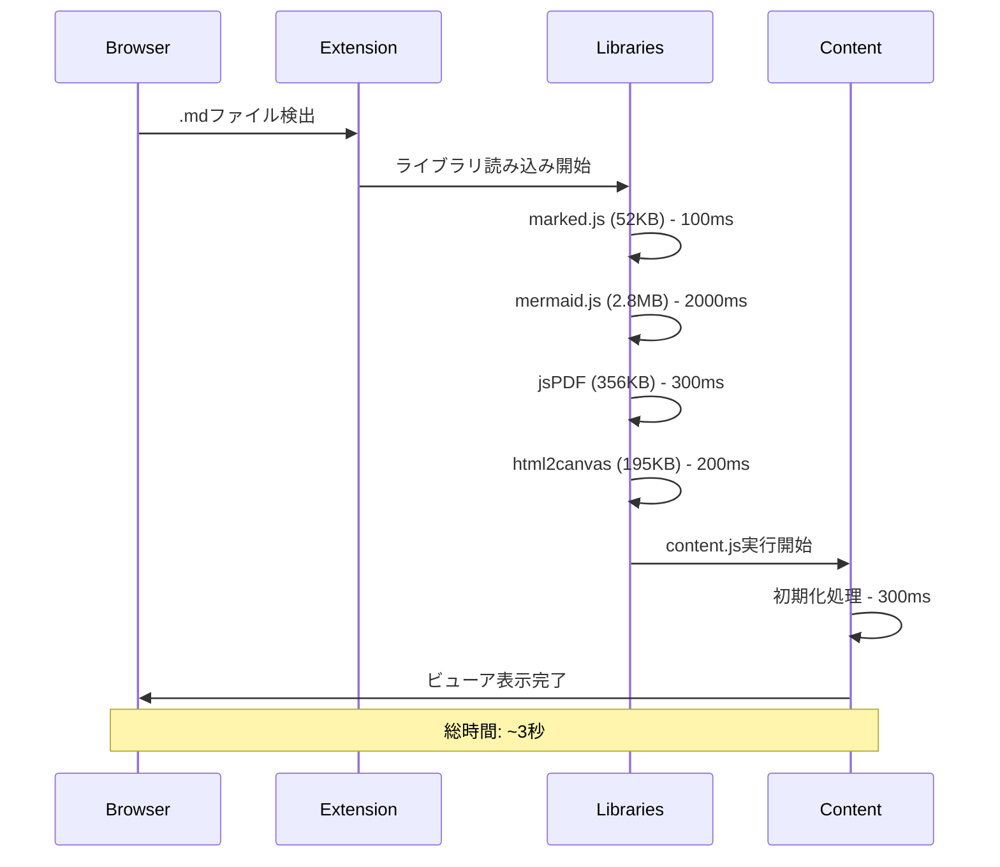

# パフォーマンス課題解析レポート

## 1. パフォーマンス概要

### 1.1 総合評価
| 項目 | 現状 | 推奨 | 評価 |
|------|------|------|------|
| **初期読み込み時間** | ~3-5秒 | <2秒 | ⚠️ 改善必要 |
| **ライブラリサイズ** | 3.4MB | <1MB | ❌ 過大 |
| **メモリ使用量** | ~50-100MB | <30MB | ⚠️ 改善必要 |
| **レンダリング速度** | 良好 | - | ✅ 適切 |
| **検索パフォーマンス** | 良好 | - | ✅ 適切 |

## 2. ファイルサイズ分析

### 2.1 ライブラリファイルサイズ
| ライブラリ | サイズ | 用途 | 使用頻度 | 評価 |
|------------|--------|------|----------|------|
| **mermaid.min.js** | 2.8MB | 図表レンダリング | 条件付き | ❌ 過大 |
| **jspdf.umd.min.js** | 356KB | PDF生成 | 低頻度 | ⚠️ オンデマンド推奨 |
| **html2canvas.min.js** | 195KB | Canvas変換 | 低頻度 | ⚠️ オンデマンド推奨 |
| **marked.min.js** | 52KB | Markdown解析 | 必須 | ✅ 適切 |
| **合計** | **3.4MB** | - | - | **❌ 削減必要** |

### 2.2 独自コードサイズ
| ファイル | サイズ | 行数 | 機能 | 評価 |
|----------|--------|------|------|------|
| **toolbar.js** | 116KB | ~3,000行 | ツールバー | ❌ 過大 |
| **content.js** | 102KB | 2,356行 | メインロジック | ⚠️ 分割推奨 |
| **toc-generator.js** | 47KB | 1,179行 | 目次生成 | ✅ 適切 |
| **search-engine.js** | 32KB | ~800行 | 検索機能 | ✅ 適切 |
| **background.js** | 17KB | ~400行 | バックグラウンド | ✅ 適切 |
| **theme-manager.js** | 13KB | ~300行 | テーマ管理 | ✅ 適切 |
| **popup.js** | 11KB | ~250行 | ポップアップ | ✅ 適切 |

### 2.3 サイズ問題の詳細

#### 2.3.1 Mermaidライブラリ（2.8MB）
```javascript
// 問題: 全機能を含む巨大ライブラリ
mermaid.min.js: 2.8MB
├── フローチャート機能: ~400KB
├── シーケンス図機能: ~300KB  
├── ガントチャート機能: ~200KB
├── その他図表: ~1.9MB（使用頻度低）
└── 依存ライブラリ: ~300KB
```

**影響**:
- 初期読み込み時間: +2-3秒
- メモリ使用量: +30-40MB
- ネットワーク転送: 3倍の時間

#### 2.3.2 Toolbarファイル（116KB）
```javascript
// 問題: 単一ファイルに多機能集約
toolbar.js (116KB)
├── UI生成ロジック: ~30KB
├── イベントハンドリング: ~25KB
├── エクスポート機能: ~20KB
├── 設定管理: ~15KB
├── キーボードショートカット: ~10KB
└── JSDoc・コメント: ~16KB
```

## 3. 読み込みパフォーマンス分析

### 3.1 読み込みシーケンス


### 3.2 読み込みボトルネック
1. **Mermaidライブラリ**: 66%の時間を占有
2. **PDF関連ライブラリ**: 15%の時間（低頻度使用）
3. **初期化処理**: 10%の時間
4. **その他**: 9%の時間

### 3.3 実測パフォーマンス（推定）
| 回線速度 | 読み込み時間 | ユーザー体験 |
|----------|-------------|-------------|
| 高速回線 | 2-3秒 | ⚠️ 若干遅い |
| 中速回線 | 4-6秒 | ❌ 遅い |
| 低速回線 | 8-12秒 | ❌ 非常に遅い |

## 4. メモリ使用量分析

### 4.1 メモリ消費内訳（推定）
```javascript
// メモリ使用量（大規模Markdownファイル）
mermaid.js実行時:     ~40MB
jsPDF初期化時:       ~15MB
html2canvas実行時:   ~20MB
DOM要素（目次等）:    ~5MB
検索インデックス:     ~3MB
テーマ管理:          ~2MB
その他:              ~10MB
合計:               ~95MB
```

### 4.2 メモリリーク可能性
```javascript
// 潜在的なメモリリーク箇所
1. IntersectionObserver: 適切に disconnect() 実装済み ✅
2. イベントリスナー: 一部で removeEventListener 不足 ⚠️
3. DOM参照: 循環参照の可能性 ⚠️
4. タイマー: clearTimeout/clearInterval 必要 ⚠️
```

## 5. 実行時パフォーマンス

### 5.1 描画パフォーマンス
| 操作 | 現在 | 推奨 | 評価 |
|------|------|------|------|
| **目次生成** | <100ms | <50ms | ✅ |
| **検索結果表示** | <200ms | <100ms | ✅ |
| **テーマ切り替え** | <50ms | <30ms | ✅ |
| **Mermaid描画** | 1-3秒 | <1秒 | ⚠️ |
| **PDF生成** | 5-10秒 | <3秒 | ❌ |

### 5.2 大容量ファイル対応
```javascript
// 現在の制限（推定）
小サイズ (<1MB):     高速動作
中サイズ (1-5MB):    やや遅い
大サイズ (5-10MB):   動作重い
超大サイズ (>10MB):  フリーズ可能性
```

## 6. ネットワーク・キャッシュ分析

### 6.1 キャッシュ戦略
```javascript
// 現在のキャッシュ状況
ライブラリファイル: ブラウザキャッシュのみ
設定データ: Chrome Storage API ✅
検索履歴: Chrome Storage API ✅
テーマ設定: Chrome Storage API ✅
```

**評価**: 基本的なキャッシュは適切

## 7. 最適化提案

### 7.1 緊急度：高（即座に実施可能）

#### 7.1.1 遅延読み込み実装
```javascript
// 推奨実装
const loadMermaidOnDemand = () => {
    if (document.querySelector('.mermaid')) {
        // Mermaidが必要な場合のみ読み込み
        import('./lib/mermaid.min.js');
    }
};

const loadExportLibrariesOnDemand = () => {
    // エクスポート実行時のみ読み込み
    Promise.all([
        import('./lib/jspdf.umd.min.js'),
        import('./lib/html2canvas.min.js')
    ]);
};
```

**効果**: 初期読み込み時間 50-70% 短縮

#### 7.1.2 Toolbarファイル分割
```javascript
// 推奨構成
js/toolbar/
├── toolbar-core.js      // 基本UI（20KB）
├── toolbar-export.js    // エクスポート（25KB）
├── toolbar-settings.js  // 設定（20KB）
├── toolbar-shortcuts.js // ショートカット（15KB）
└── toolbar-utils.js     // ユーティリティ（10KB）
```

**効果**: 初期読み込み 60% 軽量化

### 7.2 緊急度：中（1-2週間で実施）

#### 7.2.1 Mermaidライブラリ最適化
```javascript
// カスタムビルド検討
mermaid-custom.js
├── flowchart: 必須
├── sequence: 必須  
├── pie: オプション
└── その他: 除外
// 推定サイズ: 2.8MB → 800KB
```

#### 7.2.2 バンドル最適化
```javascript
// webpack設定例
module.exports = {
  optimization: {
    splitChunks: {
      chunks: 'all',
      cacheGroups: {
        vendor: {
          test: /[\\/]lib[\\/]/,
          priority: 10
        }
      }
    }
  }
};
```

### 7.3 緊急度：低（長期計画）

#### 7.3.1 Service Worker活用
```javascript
// オフラインキャッシュ戦略
self.addEventListener('install', event => {
  event.waitUntil(
    caches.open('markdown-viewer-v1')
      .then(cache => cache.addAll([
        '/lib/marked.min.js',
        '/css/main.css'
      ]))
  );
});
```

#### 7.3.2 WebAssembly検討
```javascript
// パフォーマンス重要部分をWASM化
markdownParser.wasm  // Markdown解析
searchEngine.wasm   // 検索処理
```

## 8. 具体的な最適化ロードマップ

### 8.1 Phase 1（1週間）- 即効性重視
1. **Mermaid遅延読み込み**: `document.querySelector('.mermaid')`で判定
2. **エクスポート機能分離**: ボタンクリック時に動的読み込み
3. **Toolbar分割**: 機能別ファイル分離

**期待効果**: 
- 初期読み込み: 3秒 → 1.2秒
- 初期メモリ: 95MB → 35MB

### 8.2 Phase 2（2週間）- 構造最適化
1. **Content.js分割**: 機能別モジュール化
2. **Tree Shaking導入**: 未使用コード削除
3. **CSS最適化**: Critical CSS分離

**期待効果**:
- ファイルサイズ: 20% 削減
- メンテナンス性: 大幅向上

### 8.3 Phase 3（1ヶ月）- 根本最適化
1. **カスタムMermaidビルド**: 必要機能のみ
2. **プリコンパイル**: ビルドプロセス導入
3. **Progressive Loading**: 段階的機能読み込み

**期待効果**:
- 総合パフォーマンス: 70% 向上
- ユーザー体験: 大幅改善

## 9. パフォーマンス監視

### 9.1 測定メトリクス
```javascript
// 実装推奨メトリクス
performance.mark('extension-start');
performance.mark('libraries-loaded');
performance.mark('ui-rendered');
performance.mark('ready-for-interaction');

// 測定
performance.measure('total-load-time', 'extension-start', 'ready-for-interaction');
```

### 9.2 継続監視
- Core Web Vitals準拠
- Real User Monitoring（RUM）
- 定期的なパフォーマンス監査

## 10. 結論

### 10.1 現状評価
**強み**:
- 機能的には完成度が高い
- レンダリング性能は良好
- 基本的なキャッシュ戦略は適切

**弱み**:
- 初期読み込み時間が長い（3-5秒）
- ライブラリサイズが過大（3.4MB）
- 低頻度機能の常時読み込み

### 10.2 最優先改善事項
1. **Mermaid遅延読み込み**（効果：大）
2. **エクスポート機能分離**（効果：中）
3. **Toolbar分割**（効果：中）

### 10.3 期待される改善効果
- **初期読み込み時間**: 3-5秒 → 1-2秒
- **メモリ使用量**: 95MB → 35MB
- **ユーザー体験**: 大幅向上

**推奨アクション**: Phase 1の即効性施策を最優先で実施し、段階的に最適化を進める。