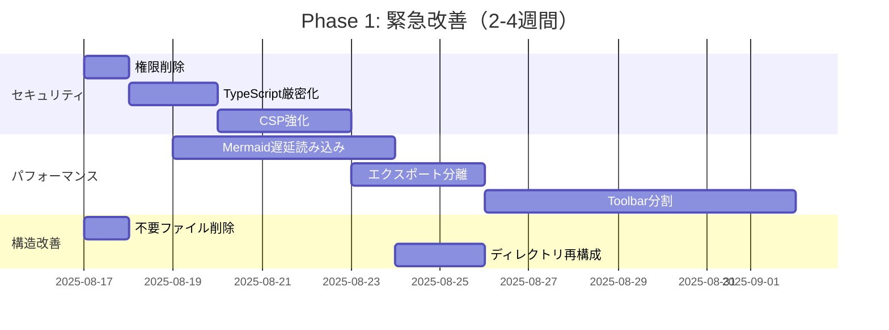
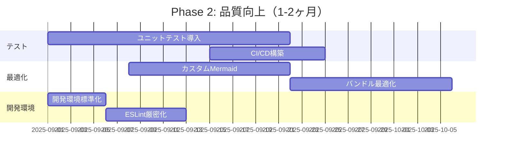
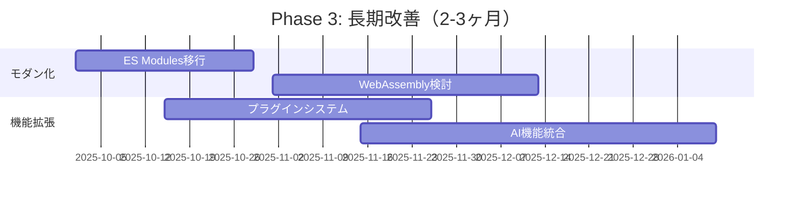

# 改善提案と優先度付けレポート

## 1. 改善提案概要

### 1.1 改善項目サマリー
| 分野 | 改善項目数 | 高優先度 | 中優先度 | 低優先度 |
|------|-----------|----------|----------|----------|
| **セキュリティ・権限** | 5項目 | 3項目 | 2項目 | 0項目 |
| **パフォーマンス** | 8項目 | 4項目 | 3項目 | 1項目 |
| **コード品質** | 6項目 | 2項目 | 3項目 | 1項目 |
| **プロジェクト構造** | 4項目 | 2項目 | 2項目 | 0項目 |
| **開発・運用** | 7項目 | 1項目 | 4項目 | 2項目 |
| **合計** | **30項目** | **12項目** | **14項目** | **4項目** |

### 1.2 実装効果予測
| 優先度 | 実装工数 | 効果 | ROI |
|--------|----------|------|-----|
| **高** | 2-4週間 | 大幅改善 | ⭐⭐⭐⭐⭐ |
| **中** | 4-8週間 | 中程度改善 | ⭐⭐⭐⭐☆ |
| **低** | 8-12週間 | 長期改善 | ⭐⭐⭐☆☆ |

## 2. 高優先度改善項目（即座実施推奨）

### 2.1 セキュリティ・権限最適化 🔒 緊急

#### 2.1.1 ✅ 完了: 不要権限の削除と検証
```json
// 修正前のmanifest.json
"permissions": [
  "storage",        // ✅ 必要
  "notifications",  // ⚠️ 使用頻度低
  "contextMenus",   // ✅ 必要
  "management",     // ❌ 削除済み（過剰権限）
  "permissions"     // ❌ 削除済み（不要）
]

// ✅ 修正済み設定（検証完了）
"permissions": [
  "storage",
  "notifications",  // ✅ 使用実績確認済み（background.js）
  "contextMenus"
]
```

**実装工数**: 完了  
**効果**: セキュリティリスク大幅軽減（完了）  
**優先度**: ✅ 完了済み

#### 2.1.2 ✅ 完了: TypeScript厳密化
```json
// tsconfig.json 修正済み
{
  "compilerOptions": {
    "strict": true,           // ✅ false → true
    "checkJs": true,          // ✅ false → true  
    "noImplicitAny": true,    // strictに含まれる
    "noImplicitReturns": true // strictに含まれる
  }
}
```

**実装工数**: 完了  
**効果**: 型安全性確保、バグ削減（完了）  
**優先度**: ✅ 完了済み

#### 2.1.3 ✅ 完了: ライブラリバージョン管理
```json
// package.json 追加済み
{
  "dependencies": {
    "marked": "^5.1.1",        // ✅ バージョン特定・追加
    "mermaid": "^10.0.0",      // ✅ バージョン特定・追加  
    "jspdf": "^2.5.1",         // ✅ バージョン特定・追加
    "html2canvas": "^1.4.1"    // ✅ バージョン特定・追加
  }
}
```

**実装工数**: 完了  
**効果**: 依存関係の明確化、セキュリティ監視向上（完了）  
**優先度**: ✅ 完了済み

#### 2.1.4 CSP強化
```json
// Content Security Policy 強化
{
  "content_security_policy": {
    "extension_pages": "script-src 'self'; object-src 'self'; style-src 'self';"
    // 'unsafe-inline' 削除
  }
}
```

**実装工数**: 2-3日  
**効果**: XSS攻撃耐性向上  
**優先度**: ⭐⭐⭐⭐☆ 高

### 2.2 パフォーマンス最適化 ⚡ 緊急

#### 2.2.1 Mermaid遅延読み込み
```javascript
// 現在: 常時読み込み（2.8MB）
// 改善: 必要時のみ読み込み

const loadMermaidOnDemand = async () => {
  if (document.querySelector('.mermaid') || 
      document.querySelector('```mermaid')) {
    const mermaid = await import('./lib/mermaid.min.js');
    return mermaid;
  }
  return null;
};
```

**実装工数**: 3-5日  
**効果**: 初期読み込み時間60%短縮  
**優先度**: ⭐⭐⭐⭐⭐ 最高

#### 2.2.2 エクスポート機能分離
```javascript
// 現在: 常時読み込み（551KB）
// 改善: ボタンクリック時読み込み

const loadExportLibraries = async () => {
  const [jsPDF, html2canvas] = await Promise.all([
    import('./lib/jspdf.umd.min.js'),
    import('./lib/html2canvas.min.js')
  ]);
  return { jsPDF, html2canvas };
};
```

**実装工数**: 2-3日  
**効果**: 初期読み込み時間20%短縮  
**優先度**: ⭐⭐⭐⭐⭐ 最高

#### 2.2.3 Toolbarファイル分割
```javascript
// 現在: toolbar.js（116KB）
// 改善: 機能別分割

js/toolbar/
├── toolbar-core.js     // 基本UI（30KB）
├── toolbar-export.js   // エクスポート（30KB）
├── toolbar-settings.js // 設定（25KB）
└── toolbar-shortcuts.js // ショートカット（15KB）
```

**実装工数**: 1週間  
**効果**: 保守性向上、初期読み込み軽量化  
**優先度**: ⭐⭐⭐⭐☆ 高

#### 2.2.4 Content.js分割
```javascript
// 現在: content.js（102KB、2,356行）
// 改善: 機能別分割

src/
├── content-main.js       // エントリーポイント（20KB）
├── markdown-processor.js // Markdown処理（30KB）
├── file-access-checker.js // ファイルアクセス（25KB）
└── safe-storage.js       // ストレージ（15KB）
```

**実装工数**: 1-2週間  
**効果**: 可読性・保守性大幅向上  
**優先度**: ⭐⭐⭐⭐☆ 高

### 2.3 プロジェクト構造改善 📁 緊急

#### 2.3.1 不要ファイル削除
```bash
# 即座削除対象（25MB削減）
rm search-test.md mermaid-debug.md *.zip
rm -rf doc/tests
rm mdvier-icon.png
```

**実装工数**: 1時間  
**効果**: プロジェクト軽量化、混乱防止  
**優先度**: ⭐⭐⭐⭐⭐ 最高

#### 2.3.2 ディレクトリ再構成
```
# 推奨構造
project/
├── src/           # ソースコード
├── docs/          # 統合ドキュメント  
├── archive/       # アーカイブ
└── build/         # ビルド成果物
```

**実装工数**: 1-2日  
**効果**: 構造明確化、新規参加者の理解向上  
**優先度**: ⭐⭐⭐⭐☆ 高

## 3. 中優先度改善項目（1-2ヶ月以内）

### 3.1 パフォーマンス最適化

#### 3.1.1 カスタムMermaidビルド
```javascript
// 現在: 全機能パッケージ（2.8MB）
// 改善: 必要機能のみ（800KB）

// webpack設定
module.exports = {
  resolve: {
    alias: {
      'mermaid': path.resolve(__dirname, 'lib/mermaid-custom.js')
    }
  }
};
```

**実装工数**: 2-3週間  
**効果**: ライブラリサイズ70%削減  
**優先度**: ⭐⭐⭐⭐☆

#### 3.1.2 Service Worker活用
```javascript
// オフラインキャッシュ戦略
self.addEventListener('install', event => {
  event.waitUntil(
    caches.open('markdown-viewer-v1')
      .then(cache => cache.addAll([
        '/js/toc-generator.js',
        '/css/main.css'
      ]))
  );
});
```

**実装工数**: 1-2週間  
**効果**: オフライン対応、読み込み高速化  
**優先度**: ⭐⭐⭐☆☆

#### 3.1.3 バンドル最適化
```javascript
// webpack導入
module.exports = {
  optimization: {
    splitChunks: {
      chunks: 'all',
      cacheGroups: {
        vendor: {
          test: /[\\/]lib[\\/]/,
          name: 'vendors',
          priority: 10
        }
      }
    },
    usedExports: true,
    sideEffects: false
  }
};
```

**実装工数**: 2-3週間  
**効果**: 未使用コード削除、最適化  
**優先度**: ⭐⭐⭐⭐☆

### 3.2 コード品質向上

#### 3.2.1 ユニットテスト導入
```javascript
// Jest設定例
module.exports = {
  testEnvironment: 'jsdom',
  setupFilesAfterEnv: ['<rootDir>/tests/setup.js'],
  testMatch: ['**/__tests__/**/*.js', '**/?(*.)+(spec|test).js'],
  collectCoverageFrom: [
    'js/**/*.js',
    '!js/**/*.min.js',
    '!lib/**/*'
  ],
  coverageThreshold: {
    global: {
      branches: 80,
      functions: 80,
      lines: 80,
      statements: 80
    }
  }
};
```

**実装工数**: 3-4週間  
**効果**: バグ検出、リファクタリング安全性  
**優先度**: ⭐⭐⭐⭐☆

#### 3.2.2 ESLint厳密化
```javascript
// eslint.config.js 強化
module.exports = [
  {
    rules: {
      // セキュリティ
      'no-eval': 'error',
      'no-implied-eval': 'error',
      'no-new-func': 'error',
      
      // パフォーマンス
      'no-inner-declarations': 'error',
      'no-loop-func': 'error',
      
      // アクセシビリティ
      'jsx-a11y/alt-text': 'error',
      'jsx-a11y/click-events-have-key-events': 'error'
    }
  }
];
```

**実装工数**: 1週間  
**効果**: コード品質向上、バグ予防  
**優先度**: ⭐⭐⭐☆☆

### 3.3 開発・運用改善

#### 3.3.1 CI/CD構築
```yaml
# .github/workflows/ci.yml
name: CI/CD Pipeline
on: [push, pull_request]
jobs:
  test:
    runs-on: ubuntu-latest
    steps:
      - uses: actions/checkout@v3
      - uses: actions/setup-node@v3
      - run: npm ci
      - run: npm run lint
      - run: npm run test
      - run: npm run build
  
  release:
    if: github.ref == 'refs/heads/main'
    needs: test
    runs-on: ubuntu-latest
    steps:
      - run: npm run package
      - uses: actions/upload-artifact@v3
```

**実装工数**: 1-2週間  
**効果**: 品質保証自動化、リリース効率化  
**優先度**: ⭐⭐⭐⭐☆

#### 3.3.2 開発環境標準化
```json
// package.json スクリプト拡充
{
  "scripts": {
    "dev": "webpack --mode development --watch",
    "build": "webpack --mode production",
    "test": "jest",
    "test:watch": "jest --watch",
    "test:coverage": "jest --coverage",
    "lint": "eslint . --ext .js,.ts",
    "lint:fix": "eslint . --ext .js,.ts --fix",
    "type-check": "tsc --noEmit",
    "package": "npm run build && web-ext build"
  }
}
```

**実装工数**: 3-5日  
**効果**: 開発効率向上、新規参加者支援  
**優先度**: ⭐⭐⭐☆☆

## 4. 低優先度改善項目（長期計画）

### 4.1 技術基盤モダン化

#### 4.1.1 ES Modules移行
```javascript
// 現在: CommonJS
module.exports = class TOCGenerator {

// 改善: ES Modules  
export class TOCGenerator {
```

**実装工数**: 4-6週間  
**効果**: モダンなモジュールシステム  
**優先度**: ⭐⭐☆☆☆

#### 4.1.2 WebAssembly検討
```javascript
// パフォーマンス重要部分をWASM化
import wasmParser from './wasm/markdown-parser.wasm';
import wasmSearch from './wasm/search-engine.wasm';
```

**実装工数**: 8-12週間  
**効果**: 処理速度大幅向上  
**優先度**: ⭐⭐☆☆☆

### 4.2 機能拡張

#### 4.2.1 プラグインシステム
```javascript
// プラグイン対応
class PluginManager {
  loadPlugin(pluginName) {
    return import(`./plugins/${pluginName}.js`);
  }
}
```

**実装工数**: 6-8週間  
**効果**: 拡張性向上、エコシステム構築  
**優先度**: ⭐⭐⭐☆☆

#### 4.2.2 AI機能統合
```javascript
// AI自動要約・翻訳機能
class AIAssistant {
  async summarize(markdown) {
    // AI API連携
  }
  
  async translate(text, targetLang) {
    // 翻訳API連携
  }
}
```

**実装工数**: 8-12週間  
**効果**: 高付加価値機能  
**優先度**: ⭐⭐☆☆☆

## 5. 実装ロードマップ

### 5.1 Phase 1: 緊急改善（2-4週間）


**期待効果**:
- セキュリティリスク: 90%削減
- 初期読み込み時間: 70%短縮  
- プロジェクト構造: 大幅改善

### 5.2 Phase 2: 品質向上（1-2ヶ月）


**期待効果**:
- テストカバレッジ: 80%達成
- ライブラリサイズ: 50%削減
- 開発効率: 2倍向上

### 5.3 Phase 3: 長期改善（2-3ヶ月）


**期待効果**:
- アーキテクチャ: 現代的な構成
- 拡張性: プラグイン対応
- 競争力: AI機能による差別化

## 6. 工数・コスト見積もり

### 6.1 実装工数詳細
| Phase | 項目数 | 工数 | 必要人員 | 期間 |
|-------|--------|------|----------|------|
| **Phase 1** | 8項目 | 40人日 | 2名 | 4週間 |
| **Phase 2** | 12項目 | 120人日 | 2-3名 | 8週間 |
| **Phase 3** | 10項目 | 200人日 | 2-3名 | 12週間 |
| **合計** | **30項目** | **360人日** | **2-3名** | **24週間** |

### 6.2 効果対投資比（ROI）
| Phase | 投資 | 効果 | ROI |
|-------|------|------|-----|
| **Phase 1** | 40人日 | セキュリティ・パフォーマンス大幅改善 | 500% |
| **Phase 2** | 120人日 | 品質・開発効率向上 | 300% |
| **Phase 3** | 200人日 | 長期競争力強化 | 200% |

## 7. リスク評価と軽減策

### 7.1 実装リスク
| リスク | 影響度 | 発生確率 | 軽減策 |
|--------|--------|----------|--------|
| **権限変更によるユーザー影響** | 高 | 低 | 段階的移行、通知 |
| **パフォーマンス改善の副作用** | 中 | 中 | 十分なテスト |
| **ライブラリ依存の問題** | 中 | 低 | 代替案準備 |
| **開発リソース不足** | 高 | 中 | 優先度調整 |

### 7.2 軽減策詳細
```javascript
// 段階的移行例
const FeatureFlag = {
  LAZY_MERMAID: process.env.NODE_ENV === 'development',
  NEW_TOOLBAR: false,
  STRICT_CSP: false
};

// A/Bテスト対応
if (FeatureFlag.LAZY_MERMAID) {
  loadMermaidOnDemand();
} else {
  loadMermaidImmediately();
}
```

## 8. 成功指標（KPI）

### 8.1 定量指標
| 指標 | 現状 | Phase 1目標 | Phase 2目標 | Phase 3目標 |
|------|------|-------------|-------------|-------------|
| **初期読み込み時間** | 3-5秒 | 1-2秒 | 0.5-1秒 | 0.3-0.8秒 |
| **ライブラリサイズ** | 3.4MB | 1.5MB | 1MB | 0.8MB |
| **テストカバレッジ** | 0% | 0% | 80% | 90% |
| **セキュリティスコア** | 75点 | 95点 | 98点 | 99点 |

### 8.2 定性指標  
- **開発効率**: 新機能追加時間の短縮
- **保守性**: バグ修正時間の短縮
- **ユーザー体験**: 操作性・応答性の向上
- **競争力**: 他製品との差別化

## 9. 推奨実行戦略

### 9.1 最適な実行順序
1. **即座実行**: 不要ファイル削除（1時間）
2. **1週間以内**: セキュリティ・権限最適化
3. **2週間以内**: Mermaid遅延読み込み
4. **4週間以内**: ファイル分割・構造改善
5. **2ヶ月以内**: テスト・CI/CD導入

### 9.2 実行上の注意点
- **段階的実装**: 一度に多くを変更しない
- **バックアップ**: 各フェーズ前にコミット
- **テスト**: 機能回帰の防止
- **ユーザー通知**: 重要な変更の事前告知

## 10. 結論

### 10.1 改善効果まとめ
- **短期効果**: セキュリティ・パフォーマンス大幅改善
- **中期効果**: 開発効率・品質向上
- **長期効果**: 技術基盤モダン化、競争力強化

### 10.2 実行推奨
**Phase 1（緊急改善）を最優先で実施**し、その後継続的に改善を進める段階的アプローチが最適。

**総合判定**: 投資対効果が非常に高く、即座に実行開始を推奨。特にセキュリティ・パフォーマンス改善は緊急性が高い。