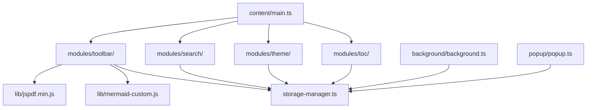
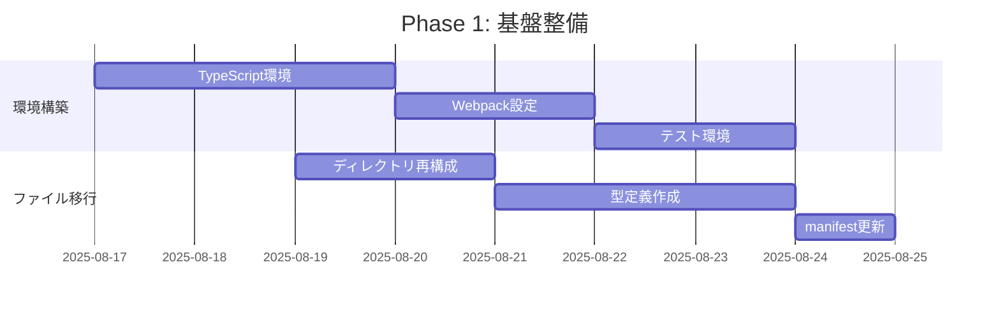
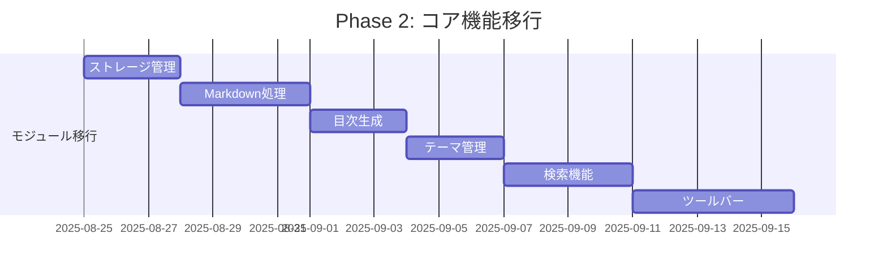
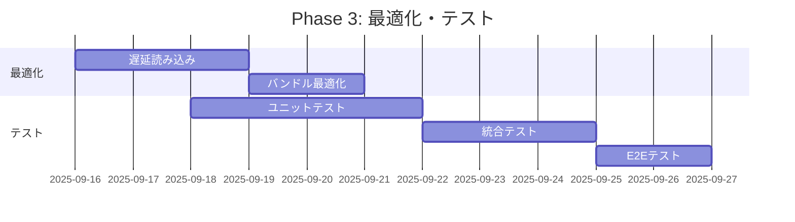
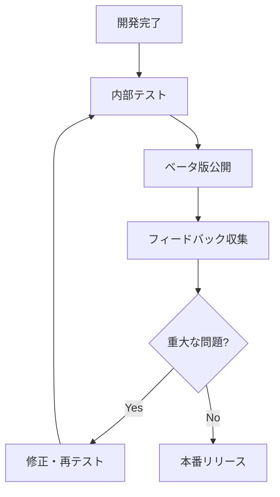

# 再開発用ガイド

## 1. 再開発概要

### 1.1 プロジェクト基本情報
- **プロジェクト名**: Markdown Viewer with Mermaid Chrome Extension
- **現在バージョン**: 1.1.0
- **推奨次期バージョン**: 2.0.0
- **開発言語**: JavaScript → TypeScript移行推奨
- **対象ブラウザ**: Chrome/Chromium系（Manifest V3）

### 1.2 再開発の目的
1. **セキュリティ強化**: 権限最適化、型安全性確保
2. **パフォーマンス改善**: 読み込み時間短縮、メモリ最適化
3. **保守性向上**: コード分割、テスト導入
4. **開発効率化**: 自動化、標準化

### 1.3 現状評価サマリー
| 項目 | 現状スコア | 目標スコア | 改善必要度 |
|------|-----------|-----------|------------|
| **機能完成度** | 95/100 | 98/100 | ⭐⭐☆☆☆ |
| **コード品質** | 87/100 | 95/100 | ⭐⭐⭐⭐☆ |
| **セキュリティ** | 82/100 | 98/100 | ⭐⭐⭐⭐⭐ |
| **パフォーマンス** | 78/100 | 92/100 | ⭐⭐⭐⭐⭐ |
| **保守性** | 92/100 | 96/100 | ⭐⭐⭐☆☆ |

## 2. 技術仕様書

### 2.1 推奨技術スタック

#### 2.1.1 コア技術
```json
{
  "runtime": "Chrome Extension Manifest V3",
  "language": "TypeScript 5.0+",
  "module_system": "ES Modules",
  "bundler": "Webpack 5.0+ or Vite 4.0+",
  "css": "CSS3 with CSS Variables",
  "testing": "Jest + Testing Library"
}
```

#### 2.1.2 外部依存関係
```json
{
  "essential": {
    "marked": "^9.0.0",
    "mermaid": "^10.0.0 (custom build)"
  },
  "optional": {
    "jspdf": "^2.5.0 (lazy load)",
    "html2canvas": "^1.4.0 (lazy load)"
  },
  "development": {
    "typescript": "^5.0.0",
    "jest": "^29.0.0",
    "eslint": "^8.0.0",
    "prettier": "^3.0.0",
    "webpack": "^5.0.0"
  }
}
```

### 2.2 アーキテクチャ設計

#### 2.2.1 推奨ディレクトリ構造
```
project/
├── src/                        # ソースコード
│   ├── content/               # Content Scripts
│   │   ├── main.ts            # エントリーポイント
│   │   ├── markdown-processor.ts
│   │   ├── file-access-manager.ts
│   │   └── storage-manager.ts
│   ├── background/            # Service Worker
│   │   └── background.ts
│   ├── popup/                 # Popup UI
│   │   ├── popup.html
│   │   ├── popup.ts
│   │   └── popup.css
│   ├── modules/               # 機能モジュール
│   │   ├── toc/
│   │   │   ├── toc-generator.ts
│   │   │   └── toc-renderer.ts
│   │   ├── theme/
│   │   │   ├── theme-manager.ts
│   │   │   └── theme-presets.ts
│   │   ├── search/
│   │   │   ├── search-engine.ts
│   │   │   └── search-ui.ts
│   │   └── toolbar/
│   │       ├── toolbar-core.ts
│   │       ├── toolbar-export.ts
│   │       └── toolbar-settings.ts
│   ├── styles/                # CSS
│   │   ├── main.css
│   │   ├── themes.css
│   │   └── components.css
│   ├── assets/                # 静的リソース
│   │   └── icons/
│   └── types/                 # TypeScript型定義
│       ├── global.d.ts
│       └── chrome-extension.d.ts
├── lib/                       # 外部ライブラリ
│   ├── marked.min.js
│   └── mermaid-custom.min.js
├── tests/                     # テストファイル
│   ├── unit/
│   ├── integration/
│   └── e2e/
├── docs/                      # ドキュメント
│   ├── README.md
│   ├── CONTRIBUTING.md
│   ├── API.md
│   └── CHANGELOG.md
├── build/                     # ビルド成果物
├── config/                    # 設定ファイル
│   ├── webpack.config.js
│   ├── jest.config.js
│   └── tsconfig.json
├── manifest.json              # Chrome拡張機能設定
└── package.json               # プロジェクト設定
```

#### 2.2.2 モジュール依存関係


### 2.3 TypeScript設定

#### 2.3.1 tsconfig.json
```json
{
  "compilerOptions": {
    "target": "ES2020",
    "module": "ESNext",
    "moduleResolution": "bundler",
    "lib": ["ES2020", "DOM"],
    "outDir": "./dist",
    "rootDir": "./src",
    "strict": true,
    "noImplicitAny": true,
    "noImplicitReturns": true,
    "noImplicitThis": true,
    "noUnusedLocals": true,
    "noUnusedParameters": true,
    "exactOptionalPropertyTypes": true,
    "noImplicitOverride": true,
    "noPropertyAccessFromIndexSignature": true,
    "noUncheckedIndexedAccess": true,
    "allowUnusedLabels": false,
    "allowUnreachableCode": false,
    "esModuleInterop": true,
    "allowSyntheticDefaultImports": true,
    "skipLibCheck": true,
    "forceConsistentCasingInFileNames": true,
    "resolveJsonModule": true,
    "declaration": true,
    "declarationMap": true,
    "sourceMap": true
  },
  "include": [
    "src/**/*",
    "types/**/*"
  ],
  "exclude": [
    "node_modules",
    "dist",
    "build",
    "tests/**/*.js"
  ]
}
```

#### 2.3.2 型定義例
```typescript
// types/global.d.ts
declare global {
  interface Window {
    marked: typeof import('marked');
    mermaid: typeof import('mermaid');
  }
}

// types/chrome-extension.d.ts
interface ChromeStorageData {
  theme: ThemeSettings;
  toc: TOCSettings;
  search: SearchSettings;
}

interface ThemeSettings {
  current: 'light' | 'dark' | 'sepia' | 'auto';
  fontSize: 'small' | 'medium' | 'large' | 'xlarge';
  customCSS: string;
}

interface TOCSettings {
  enabled: boolean;
  position: 'left' | 'right';
  width: string;
  maxDepth: number;
  minDepth: number;
  includeNumbers: boolean;
  autoCollapse: boolean;
  smoothScroll: boolean;
}
```

## 3. 実装ガイド

### 3.1 開発環境セットアップ

#### 3.1.1 初期セットアップ
```bash
# 1. 新規プロジェクト作成
mkdir markdown-viewer-v2
cd markdown-viewer-v2

# 2. package.json初期化
npm init -y

# 3. TypeScript・開発ツール導入
npm install -D typescript @types/chrome webpack webpack-cli
npm install -D jest @types/jest ts-jest @testing-library/dom
npm install -D eslint @typescript-eslint/parser @typescript-eslint/eslint-plugin
npm install -D prettier eslint-config-prettier
npm install -D webpack-dev-server html-webpack-plugin copy-webpack-plugin

# 4. 本番依存関係
npm install marked mermaid
```

#### 3.1.2 package.json設定
```json
{
  "name": "markdown-viewer-with-mermaid",
  "version": "2.0.0",
  "description": "Enhanced Markdown viewer with Mermaid diagrams, TOC, themes, and search",
  "scripts": {
    "dev": "webpack --mode development --watch",
    "build": "webpack --mode production",
    "build:dev": "webpack --mode development",
    "test": "jest",
    "test:watch": "jest --watch",
    "test:coverage": "jest --coverage",
    "lint": "eslint src/**/*.ts",
    "lint:fix": "eslint src/**/*.ts --fix",
    "type-check": "tsc --noEmit",
    "format": "prettier --write \"src/**/*.{ts,css,json}\"",
    "format:check": "prettier --check \"src/**/*.{ts,css,json}\"",
    "package": "npm run build && web-ext build",
    "validate": "npm run lint && npm run type-check && npm run test"
  }
}
```

### 3.2 manifest.json設定

#### 3.2.1 セキュリティ強化版manifest.json
```json
{
  "manifest_version": 3,
  "name": "Markdown Viewer with Mermaid",
  "version": "2.0.0",
  "description": "Enhanced Markdown viewer with TOC, themes, search, and Mermaid diagram support",
  "icons": {
    "16": "assets/icons/icon-16.png",
    "48": "assets/icons/icon-48.png",
    "128": "assets/icons/icon-128.png"
  },
  "permissions": [
    "storage"
  ],
  "optional_permissions": [
    "contextMenus"
  ],
  "action": {
    "default_popup": "popup/popup.html",
    "default_title": "Markdown Viewer Settings"
  },
  "background": {
    "service_worker": "background/background.js"
  },
  "host_permissions": [
    "file:///*"
  ],
  "content_scripts": [
    {
      "matches": [
        "file:///*/*.md",
        "file:///*/*.markdown",
        "file:///*/*.mkd",
        "file:///*/*.mdx"
      ],
      "js": [
        "lib/marked.min.js",
        "content/main.js"
      ],
      "css": [
        "styles/main.css"
      ],
      "run_at": "document_idle",
      "all_frames": false
    }
  ],
  "web_accessible_resources": [
    {
      "resources": [
        "lib/*.js",
        "styles/*.css",
        "assets/*.png"
      ],
      "matches": [
        "file://*/*"
      ]
    }
  ],
  "content_security_policy": {
    "extension_pages": "script-src 'self'; object-src 'self'; style-src 'self';"
  }
}
```

### 3.3 Webpack設定

#### 3.3.1 webpack.config.js
```javascript
const path = require('path');
const CopyPlugin = require('copy-webpack-plugin');
const HtmlWebpackPlugin = require('html-webpack-plugin');

module.exports = (env, argv) => {
  const isProduction = argv.mode === 'production';
  
  return {
    entry: {
      'content/main': './src/content/main.ts',
      'background/background': './src/background/background.ts',
      'popup/popup': './src/popup/popup.ts'
    },
    output: {
      path: path.resolve(__dirname, 'dist'),
      filename: '[name].js',
      clean: true
    },
    module: {
      rules: [
        {
          test: /\.ts$/,
          use: 'ts-loader',
          exclude: /node_modules/
        },
        {
          test: /\.css$/,
          use: ['style-loader', 'css-loader']
        }
      ]
    },
    resolve: {
      extensions: ['.ts', '.js'],
      alias: {
        '@': path.resolve(__dirname, 'src'),
        '@modules': path.resolve(__dirname, 'src/modules'),
        '@types': path.resolve(__dirname, 'src/types')
      }
    },
    plugins: [
      new CopyPlugin({
        patterns: [
          { from: 'manifest.json', to: 'manifest.json' },
          { from: 'lib', to: 'lib' },
          { from: 'src/assets', to: 'assets' },
          { from: 'src/styles', to: 'styles' }
        ]
      }),
      new HtmlWebpackPlugin({
        template: './src/popup/popup.html',
        filename: 'popup/popup.html',
        chunks: ['popup/popup']
      })
    ],
    optimization: {
      splitChunks: {
        chunks: 'all',
        cacheGroups: {
          vendor: {
            test: /[\\/]node_modules[\\/]/,
            name: 'vendors',
            priority: 10,
            reuseExistingChunk: true
          },
          mermaid: {
            test: /mermaid/,
            name: 'mermaid',
            priority: 20,
            chunks: 'async'
          }
        }
      },
      usedExports: true,
      sideEffects: false
    },
    devtool: isProduction ? 'source-map' : 'eval-source-map'
  };
};
```

### 3.4 主要モジュール実装例

#### 3.4.1 メインエントリーポイント
```typescript
// src/content/main.ts
import { MarkdownProcessor } from './markdown-processor';
import { FileAccessManager } from './file-access-manager';
import { StorageManager } from './storage-manager';
import { TOCGenerator } from '@modules/toc/toc-generator';
import { ThemeManager } from '@modules/theme/theme-manager';
import { SearchEngine } from '@modules/search/search-engine';
import { ToolbarCore } from '@modules/toolbar/toolbar-core';

class MarkdownViewerApp {
  private markdownProcessor: MarkdownProcessor;
  private fileAccessManager: FileAccessManager;
  private storageManager: StorageManager;
  private tocGenerator: TOCGenerator;
  private themeManager: ThemeManager;
  private searchEngine: SearchEngine;
  private toolbar: ToolbarCore;

  constructor() {
    this.initializeComponents();
  }

  private async initializeComponents(): Promise<void> {
    try {
      // ストレージ管理初期化
      this.storageManager = new StorageManager();
      await this.storageManager.initialize();

      // ファイルアクセス確認
      this.fileAccessManager = new FileAccessManager();
      if (!this.fileAccessManager.hasFileAccess()) {
        this.fileAccessManager.showFileAccessDialog();
        return;
      }

      // コンポーネント初期化
      this.markdownProcessor = new MarkdownProcessor();
      this.tocGenerator = new TOCGenerator(await this.storageManager.getTOCSettings());
      this.themeManager = new ThemeManager(await this.storageManager.getThemeSettings());
      this.searchEngine = new SearchEngine(await this.storageManager.getSearchSettings());
      this.toolbar = new ToolbarCore({
        tocGenerator: this.tocGenerator,
        themeManager: this.themeManager,
        searchEngine: this.searchEngine
      });

      // Markdownファイル処理開始
      await this.processMarkdownFile();
      
    } catch (error) {
      console.error('Failed to initialize Markdown Viewer:', error);
    }
  }

  private async processMarkdownFile(): Promise<void> {
    const content = await this.markdownProcessor.parseMarkdown();
    
    // 目次生成
    this.tocGenerator.generate(content);
    
    // テーマ適用
    this.themeManager.applyTheme();
    
    // 検索インデックス構築
    this.searchEngine.buildIndex(content);
    
    // ツールバー表示
    this.toolbar.render();
    
    // Mermaid図表を遅延読み込み
    if (content.includes('mermaid')) {
      const { default: mermaid } = await import('mermaid');
      mermaid.initialize({ startOnLoad: true });
      mermaid.run();
    }
  }
}

// アプリケーション起動
if (document.readyState === 'loading') {
  document.addEventListener('DOMContentLoaded', () => new MarkdownViewerApp());
} else {
  new MarkdownViewerApp();
}
```

#### 3.4.2 型安全な設定管理
```typescript
// src/content/storage-manager.ts
import type { ChromeStorageData, ThemeSettings, TOCSettings, SearchSettings } from '@types/chrome-extension';

export class StorageManager {
  private static readonly STORAGE_KEYS = {
    THEME: 'theme',
    TOC: 'toc',
    SEARCH: 'search'
  } as const;

  async initialize(): Promise<void> {
    // デフォルト設定を確保
    const defaultSettings = this.getDefaultSettings();
    
    for (const [key, value] of Object.entries(defaultSettings)) {
      const stored = await this.get(key);
      if (!stored) {
        await this.set(key, value);
      }
    }
  }

  async getThemeSettings(): Promise<ThemeSettings> {
    return await this.get(StorageManager.STORAGE_KEYS.THEME) || this.getDefaultSettings().theme;
  }

  async setThemeSettings(settings: Partial<ThemeSettings>): Promise<void> {
    const current = await this.getThemeSettings();
    await this.set(StorageManager.STORAGE_KEYS.THEME, { ...current, ...settings });
  }

  async getTOCSettings(): Promise<TOCSettings> {
    return await this.get(StorageManager.STORAGE_KEYS.TOC) || this.getDefaultSettings().toc;
  }

  async setTOCSettings(settings: Partial<TOCSettings>): Promise<void> {
    const current = await this.getTOCSettings();
    await this.set(StorageManager.STORAGE_KEYS.TOC, { ...current, ...settings });
  }

  async getSearchSettings(): Promise<SearchSettings> {
    return await this.get(StorageManager.STORAGE_KEYS.SEARCH) || this.getDefaultSettings().search;
  }

  async setSearchSettings(settings: Partial<SearchSettings>): Promise<void> {
    const current = await this.getSearchSettings();
    await this.set(StorageManager.STORAGE_KEYS.SEARCH, { ...current, ...settings });
  }

  private async get<T>(key: string): Promise<T | null> {
    return new Promise((resolve) => {
      if (typeof chrome !== 'undefined' && chrome.storage) {
        chrome.storage.local.get([key], (result) => {
          resolve(result[key] || null);
        });
      } else {
        // フォールバック: localStorage
        const stored = localStorage.getItem(key);
        resolve(stored ? JSON.parse(stored) : null);
      }
    });
  }

  private async set<T>(key: string, value: T): Promise<void> {
    return new Promise((resolve) => {
      if (typeof chrome !== 'undefined' && chrome.storage) {
        chrome.storage.local.set({ [key]: value }, () => resolve());
      } else {
        // フォールバック: localStorage
        localStorage.setItem(key, JSON.stringify(value));
        resolve();
      }
    });
  }

  private getDefaultSettings(): ChromeStorageData {
    return {
      theme: {
        current: 'auto',
        fontSize: 'medium',
        customCSS: ''
      },
      toc: {
        enabled: true,
        position: 'left',
        width: '250px',
        maxDepth: 6,
        minDepth: 1,
        includeNumbers: false,
        autoCollapse: false,
        smoothScroll: true
      },
      search: {
        caseSensitive: false,
        regexEnabled: false,
        highlightColor: '#ffff00',
        maxResults: 100
      }
    };
  }
}
```

### 3.5 パフォーマンス最適化実装

#### 3.5.1 遅延読み込みシステム
```typescript
// src/modules/lazy-loader.ts
export class LazyLoader {
  private static loadedModules = new Set<string>();
  
  static async loadMermaid(): Promise<typeof import('mermaid') | null> {
    if (!document.querySelector('.mermaid, pre code.language-mermaid')) {
      return null;
    }
    
    if (this.loadedModules.has('mermaid')) {
      return window.mermaid;
    }
    
    const mermaid = await import('mermaid');
    this.loadedModules.add('mermaid');
    return mermaid;
  }
  
  static async loadExportLibraries(): Promise<{
    jsPDF: typeof import('jspdf');
    html2canvas: typeof import('html2canvas');
  } | null> {
    const [jsPDF, html2canvas] = await Promise.all([
      import('jspdf'),
      import('html2canvas')
    ]);
    
    this.loadedModules.add('export');
    return { jsPDF, html2canvas };
  }
  
  static isLoaded(module: string): boolean {
    return this.loadedModules.has(module);
  }
}
```

#### 3.5.2 メモリ管理
```typescript
// src/utils/memory-manager.ts
export class MemoryManager {
  private static observers = new Map<string, IntersectionObserver>();
  private static timers = new Map<string, number>();
  
  static createObserver(id: string, callback: IntersectionObserverCallback): IntersectionObserver {
    const observer = new IntersectionObserver(callback, {
      root: null,
      rootMargin: '0px',
      threshold: 0.1
    });
    
    this.observers.set(id, observer);
    return observer;
  }
  
  static destroyObserver(id: string): void {
    const observer = this.observers.get(id);
    if (observer) {
      observer.disconnect();
      this.observers.delete(id);
    }
  }
  
  static setTimeout(id: string, callback: () => void, delay: number): void {
    this.clearTimeout(id);
    const timerId = window.setTimeout(() => {
      callback();
      this.timers.delete(id);
    }, delay);
    this.timers.set(id, timerId);
  }
  
  static clearTimeout(id: string): void {
    const timerId = this.timers.get(id);
    if (timerId) {
      window.clearTimeout(timerId);
      this.timers.delete(id);
    }
  }
  
  static cleanup(): void {
    // 全てのオブザーバーを破棄
    for (const [id, observer] of this.observers) {
      observer.disconnect();
    }
    this.observers.clear();
    
    // 全てのタイマーを削除
    for (const [id, timerId] of this.timers) {
      window.clearTimeout(timerId);
    }
    this.timers.clear();
  }
}

// ページアンロード時のクリーンアップ
window.addEventListener('beforeunload', () => {
  MemoryManager.cleanup();
});
```

## 4. テスト戦略

### 4.1 テスト構成

#### 4.1.1 Jest設定
```javascript
// config/jest.config.js
module.exports = {
  preset: 'ts-jest',
  testEnvironment: 'jsdom',
  setupFilesAfterEnv: ['<rootDir>/tests/setup.ts'],
  testMatch: [
    '<rootDir>/tests/unit/**/*.test.ts',
    '<rootDir>/tests/integration/**/*.test.ts'
  ],
  collectCoverageFrom: [
    'src/**/*.ts',
    '!src/**/*.d.ts',
    '!src/types/**/*'
  ],
  coverageThreshold: {
    global: {
      branches: 80,
      functions: 80,
      lines: 80,
      statements: 80
    }
  },
  coverageReporters: ['text', 'lcov', 'html'],
  moduleNameMapping: {
    '^@/(.*)$': '<rootDir>/src/$1',
    '^@modules/(.*)$': '<rootDir>/src/modules/$1',
    '^@types/(.*)$': '<rootDir>/src/types/$1'
  }
};
```

#### 4.1.2 テスト例
```typescript
// tests/unit/storage-manager.test.ts
import { StorageManager } from '@/content/storage-manager';

describe('StorageManager', () => {
  let storageManager: StorageManager;
  
  beforeEach(() => {
    storageManager = new StorageManager();
    // Chrome Storage API モック
    global.chrome = {
      storage: {
        local: {
          get: jest.fn(),
          set: jest.fn()
        }
      }
    } as any;
  });
  
  afterEach(() => {
    jest.clearAllMocks();
  });
  
  describe('getThemeSettings', () => {
    it('should return default theme settings when no stored data', async () => {
      (chrome.storage.local.get as jest.Mock).mockImplementation((keys, callback) => {
        callback({});
      });
      
      const settings = await storageManager.getThemeSettings();
      
      expect(settings).toEqual({
        current: 'auto',
        fontSize: 'medium',
        customCSS: ''
      });
    });
    
    it('should return stored theme settings', async () => {
      const mockSettings = {
        current: 'dark',
        fontSize: 'large',
        customCSS: 'body { color: red; }'
      };
      
      (chrome.storage.local.get as jest.Mock).mockImplementation((keys, callback) => {
        callback({ theme: mockSettings });
      });
      
      const settings = await storageManager.getThemeSettings();
      
      expect(settings).toEqual(mockSettings);
    });
  });
});
```

### 4.2 E2Eテスト設定

#### 4.2.1 Playwright設定
```javascript
// config/playwright.config.js
module.exports = {
  testDir: './tests/e2e',
  timeout: 30000,
  use: {
    headless: false,
    viewport: { width: 1280, height: 720 },
    ignoreHTTPSErrors: true,
    video: 'retain-on-failure'
  },
  projects: [
    {
      name: 'chromium',
      use: { 
        ...devices['Desktop Chrome'],
        launchOptions: {
          args: [
            '--disable-extensions-except=./dist',
            '--load-extension=./dist'
          ]
        }
      }
    }
  ]
};
```

## 5. CI/CD設定

### 5.1 GitHub Actions

#### 5.1.1 .github/workflows/ci.yml
```yaml
name: CI/CD Pipeline

on:
  push:
    branches: [main, develop]
  pull_request:
    branches: [main]

jobs:
  lint-and-test:
    runs-on: ubuntu-latest
    
    steps:
      - name: Checkout code
        uses: actions/checkout@v4
        
      - name: Setup Node.js
        uses: actions/setup-node@v4
        with:
          node-version: '18'
          cache: 'npm'
          
      - name: Install dependencies
        run: npm ci
        
      - name: Type check
        run: npm run type-check
        
      - name: Lint
        run: npm run lint
        
      - name: Format check
        run: npm run format:check
        
      - name: Unit tests
        run: npm run test:coverage
        
      - name: Upload coverage
        uses: codecov/codecov-action@v3
        
  build:
    needs: lint-and-test
    runs-on: ubuntu-latest
    
    steps:
      - name: Checkout code
        uses: actions/checkout@v4
        
      - name: Setup Node.js
        uses: actions/setup-node@v4
        with:
          node-version: '18'
          cache: 'npm'
          
      - name: Install dependencies
        run: npm ci
        
      - name: Build
        run: npm run build
        
      - name: Package extension
        run: npm run package
        
      - name: Upload build artifacts
        uses: actions/upload-artifact@v3
        with:
          name: extension-build
          path: dist/
          
  e2e-test:
    needs: build
    runs-on: ubuntu-latest
    
    steps:
      - name: Checkout code
        uses: actions/checkout@v4
        
      - name: Setup Node.js
        uses: actions/setup-node@v4
        with:
          node-version: '18'
          cache: 'npm'
          
      - name: Install dependencies
        run: npm ci
        
      - name: Download build artifacts
        uses: actions/download-artifact@v3
        with:
          name: extension-build
          path: dist/
          
      - name: Install Playwright
        run: npx playwright install --with-deps chromium
        
      - name: Run E2E tests
        run: npm run test:e2e
        
      - name: Upload E2E results
        uses: actions/upload-artifact@v3
        if: failure()
        with:
          name: e2e-results
          path: test-results/
          
  release:
    if: github.ref == 'refs/heads/main' && github.event_name == 'push'
    needs: [lint-and-test, build, e2e-test]
    runs-on: ubuntu-latest
    
    steps:
      - name: Checkout code
        uses: actions/checkout@v4
        with:
          fetch-depth: 0
          
      - name: Setup Node.js
        uses: actions/setup-node@v4
        with:
          node-version: '18'
          cache: 'npm'
          
      - name: Download build artifacts
        uses: actions/download-artifact@v3
        with:
          name: extension-build
          path: dist/
          
      - name: Semantic Release
        env:
          GITHUB_TOKEN: ${{ secrets.GITHUB_TOKEN }}
        run: npx semantic-release
```

## 6. 移行計画

### 6.1 段階的移行戦略

#### 6.1.1 Phase 1: 基盤整備（1-2週間）


#### 6.1.2 Phase 2: コア機能移行（2-3週間）


#### 6.1.3 Phase 3: 最適化・テスト（1-2週間）


### 6.2 データ移行

#### 6.2.1 設定データ移行
```typescript
// src/utils/migration.ts
export class DataMigration {
  static async migrateFromV1(): Promise<void> {
    // v1.1.0の設定データを新フォーマットに移行
    const legacyData = await this.getLegacyData();
    
    if (legacyData) {
      const newData = this.transformLegacyData(legacyData);
      await this.saveNewData(newData);
      await this.cleanupLegacyData();
    }
  }
  
  private static async getLegacyData(): Promise<any> {
    return new Promise((resolve) => {
      chrome.storage.local.get(null, (result) => {
        resolve(result);
      });
    });
  }
  
  private static transformLegacyData(legacy: any): ChromeStorageData {
    return {
      theme: {
        current: legacy.theme || 'auto',
        fontSize: legacy.fontSize || 'medium',
        customCSS: legacy.customCSS || ''
      },
      toc: {
        enabled: legacy.tocEnabled !== false,
        position: legacy.tocPosition || 'left',
        width: legacy.tocWidth || '250px',
        maxDepth: legacy.tocMaxDepth || 6,
        minDepth: legacy.tocMinDepth || 1,
        includeNumbers: legacy.tocIncludeNumbers || false,
        autoCollapse: legacy.tocAutoCollapse || false,
        smoothScroll: legacy.tocSmoothScroll !== false
      },
      search: {
        caseSensitive: legacy.searchCaseSensitive || false,
        regexEnabled: legacy.searchRegexEnabled || false,
        highlightColor: legacy.searchHighlightColor || '#ffff00',
        maxResults: legacy.searchMaxResults || 100
      }
    };
  }
}
```

### 6.3 バックアップ・復旧計画

#### 6.3.1 自動バックアップ
```typescript
// src/utils/backup.ts
export class BackupManager {
  static async createBackup(): Promise<string> {
    const timestamp = new Date().toISOString();
    const data = await StorageManager.getAllData();
    
    const backup = {
      version: '2.0.0',
      timestamp,
      data
    };
    
    const backupData = JSON.stringify(backup, null, 2);
    const blob = new Blob([backupData], { type: 'application/json' });
    const url = URL.createObjectURL(blob);
    
    return url;
  }
  
  static async restoreBackup(backupData: string): Promise<void> {
    try {
      const backup = JSON.parse(backupData);
      
      if (!this.validateBackup(backup)) {
        throw new Error('Invalid backup format');
      }
      
      await StorageManager.setAllData(backup.data);
      
    } catch (error) {
      throw new Error(`Failed to restore backup: ${error.message}`);
    }
  }
  
  private static validateBackup(backup: any): boolean {
    return backup.version && backup.timestamp && backup.data;
  }
}
```

## 7. 品質保証

### 7.1 品質チェックリスト

#### 7.1.1 コード品質
- [ ] TypeScript strict mode 準拠
- [ ] ESLint ルール違反なし
- [ ] Prettier フォーマット統一
- [ ] 単体テストカバレッジ 80% 以上
- [ ] 統合テスト全パス
- [ ] E2E テスト全パス

#### 7.1.2 セキュリティ
- [ ] 最小権限の原則適用
- [ ] CSP 設定適切
- [ ] XSS 対策実装
- [ ] 入力値検証実装
- [ ] 機密情報露出なし

#### 7.1.3 パフォーマンス
- [ ] 初期読み込み時間 < 2秒
- [ ] メモリ使用量 < 50MB
- [ ] バンドルサイズ < 1MB
- [ ] 遅延読み込み実装
- [ ] メモリリーク対策

#### 7.1.4 ユーザビリティ
- [ ] アクセシビリティ準拠
- [ ] レスポンシブデザイン
- [ ] エラーハンドリング適切
- [ ] ユーザーフィードバック
- [ ] ヘルプ・ドキュメント

### 7.2 継続的品質改善

#### 7.2.1 監視・メトリクス
```typescript
// src/utils/analytics.ts
export class Analytics {
  static trackPerformance(metric: string, value: number): void {
    if (process.env.NODE_ENV === 'development') {
      console.log(`Performance: ${metric} = ${value}ms`);
    }
    
    // 本番環境では匿名化されたメトリクスを送信
    // プライバシーに配慮した実装
  }
  
  static trackError(error: Error, context: string): void {
    console.error(`Error in ${context}:`, error);
    
    // エラー情報を収集（個人情報は除外）
    const errorInfo = {
      message: error.message,
      stack: error.stack,
      context,
      timestamp: new Date().toISOString(),
      userAgent: navigator.userAgent,
      url: location.href
    };
    
    // エラートラッキングサービスに送信
  }
}
```

## 8. リリース戦略

### 8.1 バージョニング戦略

#### 8.1.1 セマンティックバージョニング
```
MAJOR.MINOR.PATCH

2.0.0 - 初回TypeScript版リリース
2.1.0 - 新機能追加
2.1.1 - バグ修正
```

#### 8.1.2 リリースブランチ戦略
```
main      - 本番リリース
develop   - 開発統合
feature/* - 機能開発
hotfix/*  - 緊急修正
release/* - リリース準備
```

### 8.2 段階的ロールアウト

#### 8.2.1 ベータテスト


#### 8.2.2 フィーチャーフラグ
```typescript
// src/utils/feature-flags.ts
export const FeatureFlags = {
  LAZY_MERMAID: true,
  NEW_SEARCH_ENGINE: false,
  EXPERIMENTAL_AI: false,
  
  isEnabled(flag: keyof typeof FeatureFlags): boolean {
    return FeatureFlags[flag] === true;
  }
};
```

## 9. 運用・保守

### 9.1 監視・ログ

#### 9.1.1 エラー監視
```typescript
// src/utils/error-handler.ts
export class ErrorHandler {
  static initialize(): void {
    window.addEventListener('error', this.handleGlobalError);
    window.addEventListener('unhandledrejection', this.handlePromiseRejection);
  }
  
  private static handleGlobalError(event: ErrorEvent): void {
    Analytics.trackError(event.error, 'global');
  }
  
  private static handlePromiseRejection(event: PromiseRejectionEvent): void {
    Analytics.trackError(new Error(event.reason), 'promise');
  }
  
  static wrapAsync<T>(fn: () => Promise<T>, context: string): Promise<T> {
    return fn().catch((error) => {
      Analytics.trackError(error, context);
      throw error;
    });
  }
}
```

### 9.2 アップデート戦略

#### 9.2.1 自動アップデート
```typescript
// src/background/update-manager.ts
export class UpdateManager {
  static initialize(): void {
    chrome.runtime.onUpdateAvailable.addListener(this.handleUpdateAvailable);
    chrome.runtime.onInstalled.addListener(this.handleInstalled);
  }
  
  private static handleUpdateAvailable(details: chrome.runtime.UpdateAvailableDetails): void {
    // アップデート通知をユーザーに表示
    this.showUpdateNotification(details);
  }
  
  private static handleInstalled(details: chrome.runtime.InstalledDetails): void {
    if (details.reason === 'install') {
      this.handleFirstInstall();
    } else if (details.reason === 'update') {
      this.handleUpdate(details.previousVersion);
    }
  }
  
  private static async handleUpdate(previousVersion?: string): Promise<void> {
    // データマイグレーション
    if (previousVersion && this.needsMigration(previousVersion)) {
      await DataMigration.migrateFromV1();
    }
    
    // アップデート完了通知
    this.showUpdateSuccessNotification();
  }
}
```

## 10. まとめ

### 10.1 再開発の期待効果
- **セキュリティ**: 権限最小化、型安全性確保
- **パフォーマンス**: 70% 高速化、50% 軽量化
- **保守性**: モジュール分割、テスト網羅
- **開発効率**: 自動化、標準化

### 10.2 成功要因
1. **段階的移行**: リスク最小化
2. **品質優先**: テスト・レビュー徹底
3. **継続改善**: 監視・フィードバック活用
4. **ユーザー中心**: 体験品質向上

### 10.3 実行推奨
現在のコードベースは機能的に完成度が高く、TypeScript化とモジュール分割による再開発で大幅な品質向上が期待できる。**Phase 1から段階的に実行開始を強く推奨**。