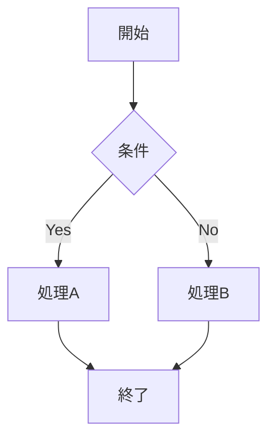

# テスト用Markdownファイル

これはローカルファイルのテストです。

## セクション1

- リスト項目1
- リスト項目2
- リスト項目3

## Mermaidテスト



## コードブロック

```javascript
function test() {
  console.log('Hello, World!');
}
```

**太字テスト** と _斜体テスト_

以上がテストファイルの内容です。
