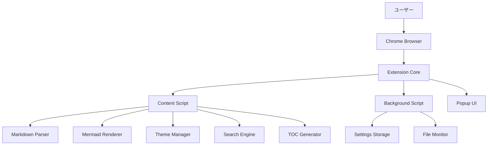
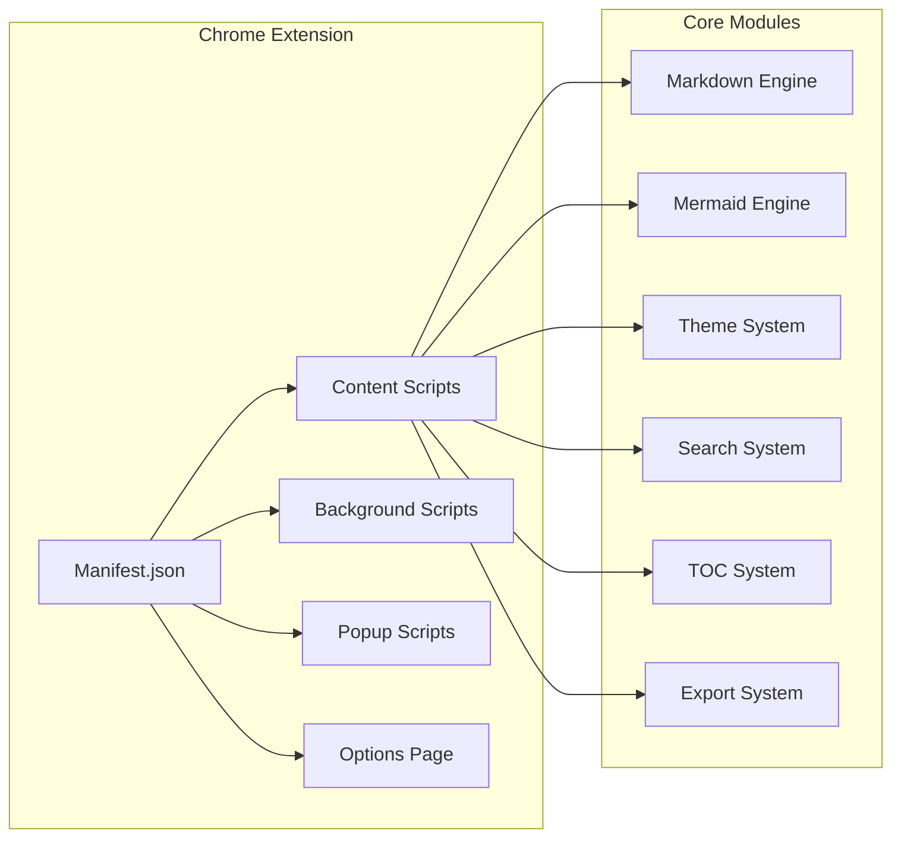
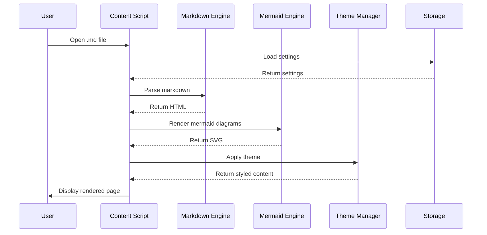

# Chrome拡張機能「Markdown Viewer with Mermaid」基本設計書

## 1. システム概要

### 1.1 システム目的
ローカルMarkdownファイルを美しく表示し、Mermaid図表を含む高機能なビューアーを提供する。開発者・技術者向けに特化した機能を持つChrome拡張機能。

### 1.2 システム構成


### 1.3 技術スタック
- **フロントエンド**: HTML5, CSS3, JavaScript (ES2020+)
- **Markdownパーサー**: marked.js v4.x
- **図表レンダリング**: mermaid.js v10.x
- **ストレージ**: Chrome Storage API
- **UI フレームワーク**: Vanilla JavaScript (軽量化のため)

## 2. アーキテクチャ設計

### 2.1 全体アーキテクチャ


### 2.2 モジュール構成

#### 2.2.1 コアモジュール
```javascript
// src/core/
├── markdown-engine.js      // Markdown解析・レンダリング
├── mermaid-engine.js       // Mermaid図表処理
├── theme-manager.js        // テーマ管理
├── search-engine.js        // 検索機能
├── toc-generator.js        // 目次生成
├── export-manager.js       // エクスポート機能
├── editor-manager.js       // Markdown編集機能
├── file-manager.js         // ファイル保存機能
└── settings-manager.js     // 設定管理
```

#### 2.2.2 UIモジュール
```javascript
// src/ui/
├── components/
│   ├── toc-panel.js        // 目次パネル
│   ├── search-panel.js     // 検索パネル
│   ├── theme-selector.js   // テーマ選択
│   └── toolbar.js          // ツールバー
├── popup/
│   ├── popup.html
│   ├── popup.js
│   └── popup.css
└── options/
    ├── options.html
    ├── options.js
    └── options.css
```

### 2.3 データフロー


## 3. 機能設計

### 3.1 Phase 1 機能設計

#### 3.1.1 目次自動生成機能
```javascript
class TOCGenerator {
    constructor(options = {}) {
        this.options = {
            maxDepth: 6,
            minDepth: 1,
            includeNumbers: true,
            smoothScroll: true,
            ...options
        };
        this.headings = [];
        this.tocElement = null;
    }
    
    // 見出し要素を抽出
    extractHeadings(container) {
        const selector = Array.from({length: this.options.maxDepth}, 
            (_, i) => `h${i + this.options.minDepth}`).join(', ');
        return container.querySelectorAll(selector);
    }
    
    // 目次HTML生成
    generateTOC() {
        // 実装詳細は詳細設計書で記述
    }
    
    // スムーススクロール
    scrollToHeading(headingId) {
        // 実装詳細は詳細設計書で記述
    }
}
```

#### 3.1.2 テーマシステム
```javascript
class ThemeManager {
    constructor() {
        this.themes = new Map();
        this.currentTheme = 'light';
        this.customCSS = '';
        this.init();
    }
    
    // テーマ登録
    registerTheme(name, themeConfig) {
        this.themes.set(name, themeConfig);
    }
    
    // テーマ適用
    applyTheme(themeName) {
        // CSS変数の更新
        // Mermaidテーマの同期
        // 設定の保存
    }
    
    // システムテーマ検出
    detectSystemTheme() {
        return window.matchMedia('(prefers-color-scheme: dark)').matches 
            ? 'dark' : 'light';
    }
}
```

#### 3.1.3 検索システム
```javascript
class SearchEngine {
    constructor(container) {
        this.container = container;
        this.searchIndex = new Map();
        this.currentResults = [];
        this.currentIndex = 0;
        this.buildIndex();
    }
    
    // 検索インデックス構築
    buildIndex() {
        // テキストノードの抽出
        // 位置情報の記録
        // インデックスの構築
    }
    
    // 検索実行
    search(query, options = {}) {
        // 正規表現サポート
        // 大文字小文字の区別
        // 結果のハイライト
    }
    
    // 検索結果のナビゲーション
    navigateResults(direction) {
        // 前後の結果への移動
        // スクロール位置の調整
    }
}
```

### 3.2 データ構造設計

#### 3.2.1 設定データ構造
```javascript
const defaultSettings = {
    theme: {
        current: 'light',
        autoDetect: true,
        customCSS: ''
    },
    editor: {
        enabled: true,
        autoSave: false,
        backupEnabled: true
    },
    fileManager: {
        defaultSaveMode: 'overwrite', // 'overwrite' or 'saveAs'
        confirmBeforeSave: true,
        backupCount: 5
    },
    toc: {
        enabled: true,
        position: 'left',
        maxDepth: 6,
        minDepth: 1,
        autoCollapse: false
    },
    search: {
        caseSensitive: false,
        regexEnabled: false,
        highlightColor: '#ffff00'
    },
    mermaid: {
        theme: 'default',
        interactive: true,
        maxWidth: '100%'
    },
    export: {
        includeCSS: true,
        includeMermaid: true,
        pageSize: 'A4'
    }
};
```

#### 3.2.2 目次データ構造
```javascript
const tocStructure = {
    headings: [
        {
            id: 'heading-1',
            level: 1,
            text: 'Introduction',
            element: HTMLElement,
            children: [
                {
                    id: 'heading-1-1',
                    level: 2,
                    text: 'Overview',
                    element: HTMLElement,
                    children: []
                }
            ]
        }
    ],
    maxDepth: 3,
    totalCount: 15
};
```

## 4. UI/UX設計

### 4.1 レイアウト設計
```
┌─────────────────────────────────────────────────────────┐
│ Toolbar [🔍] [🎨] [📋] [⚙️]                              │
├─────────────┬───────────────────────────────────────────┤
│             │                                           │
│   TOC       │                                           │
│   Panel     │         Main Content Area                 │
│             │                                           │
│ ┌─────────┐ │  ┌─────────────────────────────────────┐  │
│ │ 1. Intro│ │  │ # Document Title                    │  │
│ │ 2. Setup│ │  │                                     │  │
│ │ 3. Usage│ │  │ Content goes here...                │  │
│ │         │ │  │                                     │  │
│ └─────────┘ │  │ ```mermaid                          │  │
│             │  │ graph TD                            │  │
│             │  │   A --> B                           │  │
│             │  │ ```                                 │  │
│             │  └─────────────────────────────────────┘  │
└─────────────┴───────────────────────────────────────────┘
```

### 4.2 コンポーネント設計

#### 4.2.1 ツールバーコンポーネント
```javascript
class Toolbar {
    constructor(container) {
        this.container = container;
        this.buttons = new Map();
        this.render();
    }
    
    render() {
        this.container.innerHTML = `
            <div class="toolbar">
                <button id="search-btn" title="検索">🔍</button>
                <button id="theme-btn" title="テーマ">🎨</button>
                <button id="toc-btn" title="目次">📋</button>
                <button id="export-btn" title="エクスポート">💾</button>
                <button id="settings-btn" title="設定">⚙️</button>
            </div>
        `;
        this.bindEvents();
    }
    
    bindEvents() {
        // イベントリスナーの設定
    }
}
```

#### 4.2.2 目次パネルコンポーネント
```javascript
class TOCPanel {
    constructor(container, tocData) {
        this.container = container;
        this.tocData = tocData;
        this.isCollapsed = false;
        this.render();
    }
    
    render() {
        // 階層構造の HTML 生成
        // 折りたたみ機能の実装
        // 現在位置のハイライト
    }
    
    updateActiveHeading(headingId) {
        // アクティブな見出しの更新
    }
}
```

### 4.3 レスポンシブ設計
```css
/* デスクトップ */
@media (min-width: 1024px) {
    .toc-panel {
        width: 250px;
        position: fixed;
        left: 0;
    }
    
    .main-content {
        margin-left: 270px;
    }
}

/* タブレット */
@media (max-width: 1023px) and (min-width: 768px) {
    .toc-panel {
        width: 200px;
    }
    
    .main-content {
        margin-left: 220px;
    }
}

/* モバイル */
@media (max-width: 767px) {
    .toc-panel {
        position: fixed;
        top: 0;
        left: -250px;
        transition: left 0.3s ease;
    }
    
    .toc-panel.open {
        left: 0;
    }
    
    .main-content {
        margin-left: 0;
    }
}
```

## 5. パフォーマンス設計

### 5.1 最適化戦略
- **遅延読み込み**: 大きなMermaid図の遅延レンダリング
- **仮想スクロール**: 長文書での目次表示最適化
- **キャッシュ戦略**: レンダリング結果のキャッシュ
- **Web Workers**: 重い処理のバックグラウンド実行

### 5.2 メモリ管理
```javascript
class MemoryManager {
    constructor() {
        this.cache = new Map();
        this.maxCacheSize = 50; // MB
        this.cleanupInterval = 300000; // 5分
        this.startCleanup();
    }
    
    // キャッシュクリーンアップ
    cleanup() {
        // LRU アルゴリズムでキャッシュ削除
        // メモリ使用量の監視
    }
    
    // リソース解放
    dispose() {
        // イベントリスナーの削除
        // タイマーの停止
        // DOM参照の削除
    }
}
```

## 6. セキュリティ設計

### 6.1 セキュリティ要件
- **XSS対策**: ユーザー入力のサニタイズ
- **CSP対応**: Content Security Policy の適用
- **権限最小化**: 必要最小限の権限のみ要求

### 6.2 実装方針
```javascript
// XSS対策
function sanitizeHTML(html) {
    const div = document.createElement('div');
    div.textContent = html;
    return div.innerHTML;
}

// CSP対応
const cspMeta = document.createElement('meta');
cspMeta.httpEquiv = 'Content-Security-Policy';
cspMeta.content = "default-src 'self'; script-src 'self' 'unsafe-inline'";
document.head.appendChild(cspMeta);
```

## 7. エラーハンドリング設計

### 7.1 エラー分類
- **パース エラー**: Markdown/Mermaid の構文エラー
- **レンダリング エラー**: 表示処理の失敗
- **ストレージ エラー**: 設定保存の失敗
- **ネットワーク エラー**: 外部リソースの読み込み失敗

### 7.2 エラー処理戦略
```javascript
class ErrorHandler {
    constructor() {
        this.errorLog = [];
        this.setupGlobalHandlers();
    }
    
    setupGlobalHandlers() {
        window.addEventListener('error', this.handleError.bind(this));
        window.addEventListener('unhandledrejection', this.handlePromiseRejection.bind(this));
    }
    
    handleError(error) {
        // エラーログの記録
        // ユーザーへの通知
        // 復旧処理の実行
    }
    
    showUserFriendlyError(error) {
        // ユーザーフレンドリーなエラーメッセージ表示
    }
}
```

## 8. テスト設計

### 8.1 テスト戦略
- **単体テスト**: 各モジュールの機能テスト
- **統合テスト**: モジュール間の連携テスト
- **E2Eテスト**: ユーザーシナリオのテスト
- **パフォーマンステスト**: 負荷・速度テスト

### 8.2 テスト環境
```javascript
// Jest設定例
module.exports = {
    testEnvironment: 'jsdom',
    setupFilesAfterEnv: ['<rootDir>/test/setup.js'],
    collectCoverageFrom: [
        'src/**/*.js',
        '!src/**/*.test.js'
    ],
    coverageThreshold: {
        global: {
            branches: 80,
            functions: 80,
            lines: 80,
            statements: 80
        }
    }
};
```

## 9. 配布・更新設計

### 9.1 ビルドプロセス
```bash
# 開発ビルド
npm run build:dev

# 本番ビルド
npm run build:prod

# テスト実行
npm run test

# リント実行
npm run lint
```

### 9.2 更新戦略
- **自動更新**: Chrome Web Store経由
- **設定移行**: バージョン間の設定互換性
- **ロールバック**: 問題発生時の前バージョン復帰

---

**作成日**: 2025年1月28日  
**バージョン**: 1.0  
**作成者**: Kiro AI Assistant