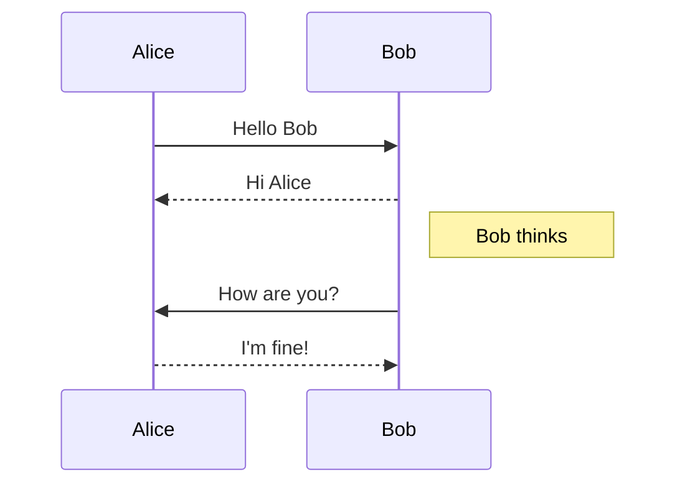
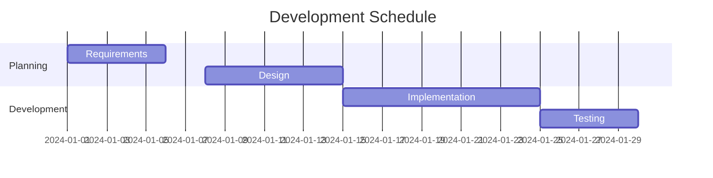
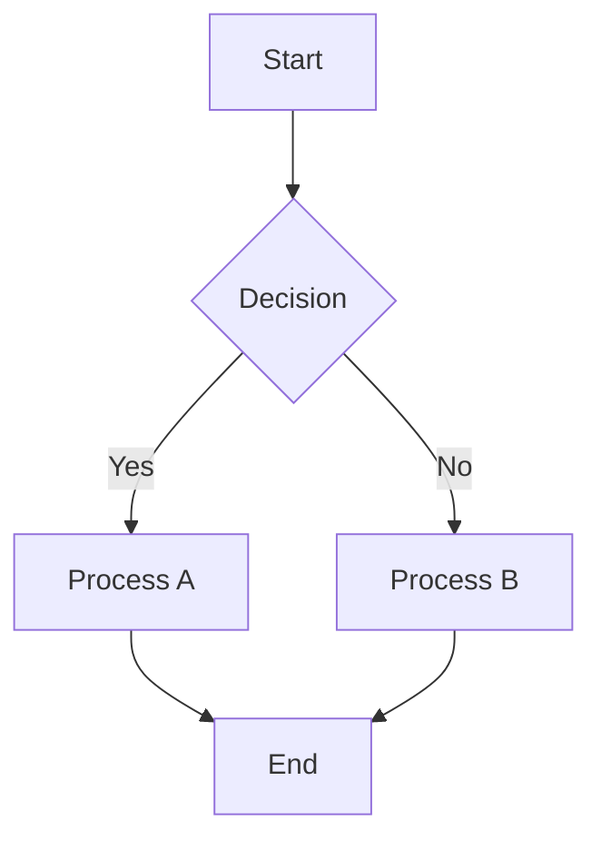
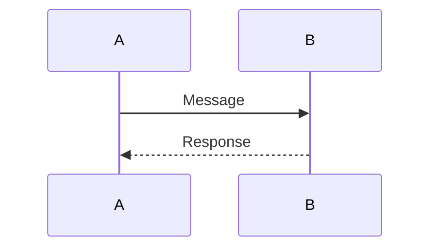
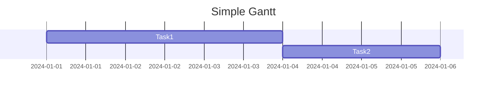

# Mermaidデバッグテスト

## シーケンス図テスト

```mermaid
sequenceDiagram
    participant A as Alice
    participant B as Bob
    A->>B: Hello Bob
    B-->>A: Hi Alice
    Note right of B: Bob thinks
    B->>A: How are you?
    A-->>B: I'm fine!
```

## ガントチャートテスト

```mermaid
gantt
    title Development Schedule
    dateFormat YYYY-MM-DD
    section Planning
    Requirements    :2024-01-01, 5d
    Design         :2024-01-08, 7d
    section Development
    Implementation :2024-01-15, 10d
    Testing        :2024-01-25, 5d
```

## フローチャートテスト（確認用）

```mermaid
flowchart TD
    A[Start] --> B{Decision}
    B -->|Yes| C[Process A]
    B -->|No| D[Process B]
    C --> E[End]
    D --> E
```

## シンプルテスト

### 基本シーケンス図

```mermaid
sequenceDiagram
    A->>B: Message
    B-->>A: Response
```

### 基本ガントチャート

```mermaid
gantt
    title Simple Gantt
    dateFormat YYYY-MM-DD
    Task1 :2024-01-01, 3d
    Task2 :2024-01-04, 2d
```