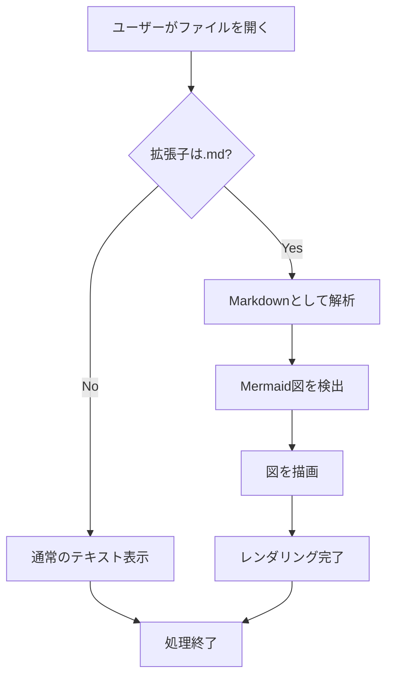
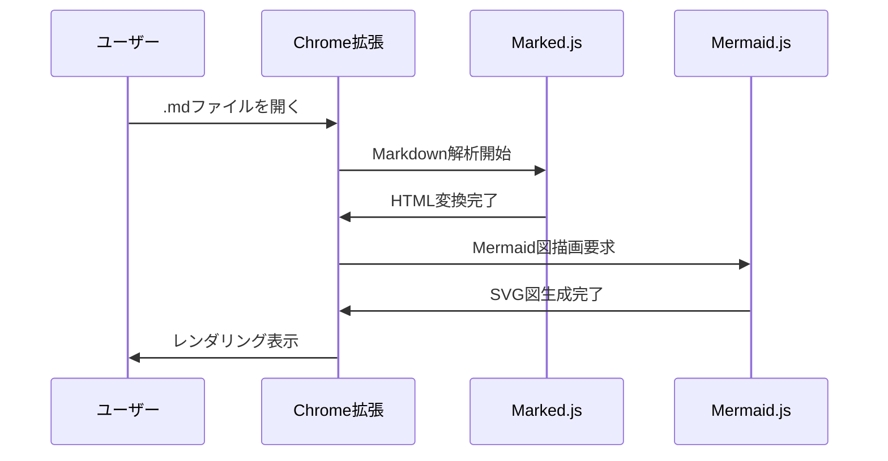
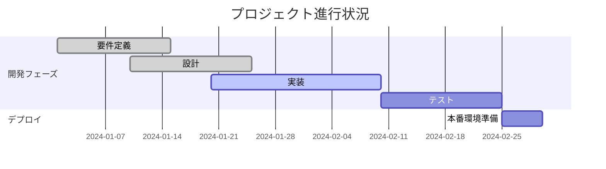

# Markdown Viewer with Mermaid 🚀

Chrome拡張機能のテストファイルです。正常に表示されていれば、この文章は美しくレンダリングされたMarkdownとして表示されます。

## 基本的なMarkdown機能

- **太字のテキスト**
- *斜体のテキスト* 
- `インラインコード`
- ~~取り消し線~~

### コードブロック

```javascript
function greetUser(name) {
    console.log(`Hello, ${name}! Welcome to Markdown Viewer!`);
    return `Greeting sent to ${name}`;
}

greetUser("World");
```

```python
def fibonacci(n):
    if n <= 1:
        return n
    return fibonacci(n-1) + fibonacci(n-2)

print([fibonacci(i) for i in range(10)])
```

## Mermaidダイアグラムのテスト

### フローチャート



### シーケンス図



### ガントチャート



## 表の表示テスト

| 機能 | 状態 | 優先度 | 備考 |
|------|------|--------|------|
| Markdown解析 | ✅ 完了 | 高 | marked.js使用 |
| Mermaid描画 | ✅ 完了 | 高 | mermaid.js使用 |
| スタイリング | ✅ 完了 | 中 | CSS適用済み |
| ファイル検出 | ✅ 完了 | 高 | 拡張子判定 |

## 引用とリンク

> **成功の秘訣**  
> このMarkdown拡張機能が正常に動作していれば、
> あなたは美しくレンダリングされたドキュメントを見ているはずです！

詳細については[GitHub](https://github.com)を参照してください。

## チェックリスト

- [x] Markdownの基本機能
- [x] Mermaid図の描画
- [x] コードシンタックス
- [x] 表の表示
- [x] 引用文の表示
- [ ] 更なる機能拡張

---

**拡張機能が正常に動作していることを確認できました！** 🎉