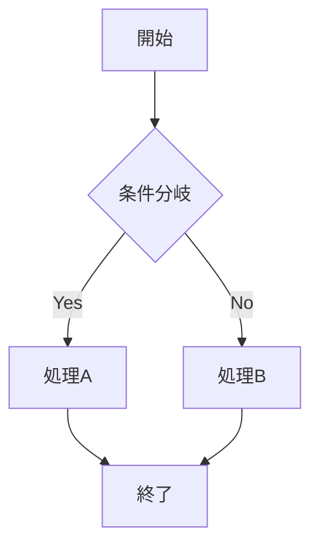
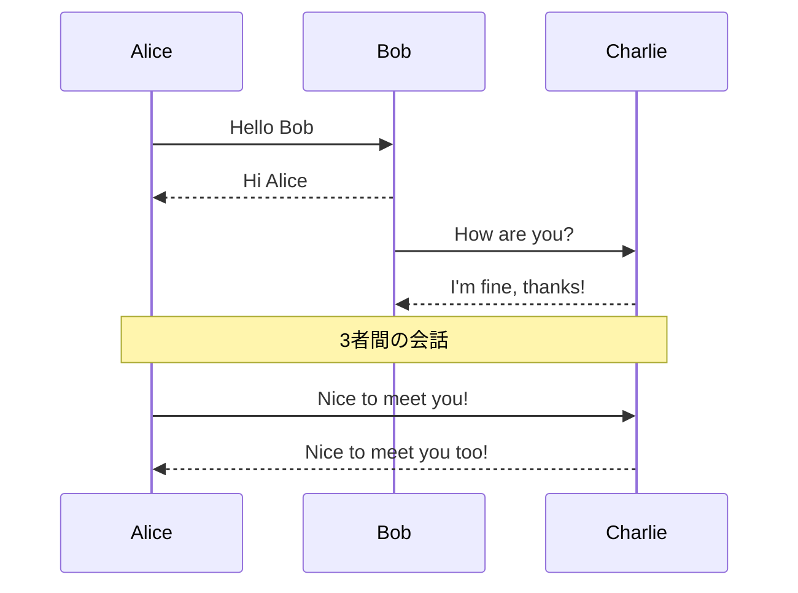
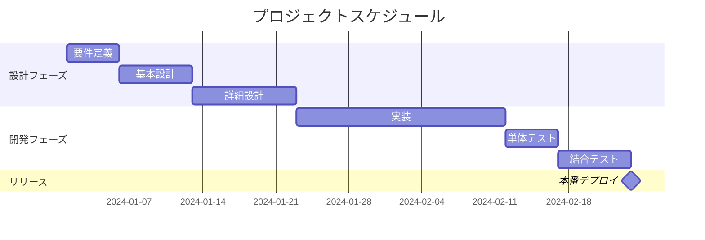
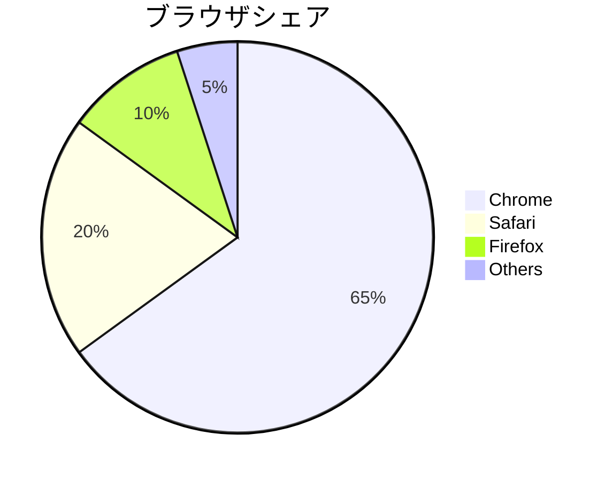

# Mermaid図表テスト（修正版）

> **修正内容**: シーケンス図とガントチャート図の表示問題を修正
> - Mermaid初期化設定を強化
> - デバッグログを改善
> - エラーハンドリングを追加

## 1. フローチャート（動作確認済み）



## 2. シーケンス図テスト



## 3. ガントチャートテスト



## 4. 検索機能テスト

このテキストは検索対象になります。検索キーワード「テスト」で検索してみてください。

### 検索確認項目

1. 通常テキストの「テスト」は検索される ✓
2. Mermaid図表内の「テスト」は検索されない ✓
3. 検索ハイライト機能が正常動作 ✓

## 5. 追加のMermaidサンプル

### クラス図

```mermaid
classDiagram
    class User {
        -id: int
        -name: string
        -email: string
        +login()
        +logout()
    }
    
    class Order {
        -orderId: int
        -orderDate: date
        +createOrder()
        +cancelOrder()
    }
    
    User ||--o{ Order : places
```

### パイチャート

