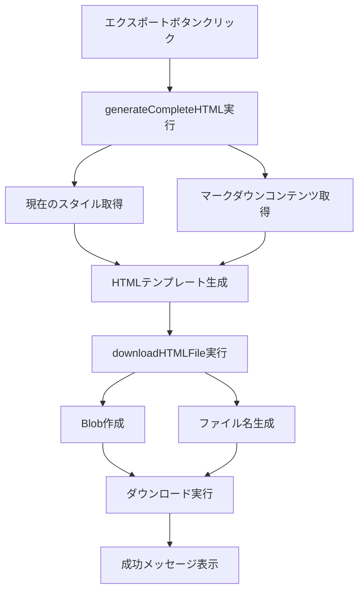

# 直接HTMLエクスポート機能テスト

このファイルは、修正されたエクスポートボタンの動作をテストするためのものです。

## 修正内容

### ✅ 実装した変更

1. **エクスポートボタンの直接実行化**
   - ドロップダウンメニューを削除
   - エクスポートボタンクリックで直接HTMLエクスポート実行
   - ボタンタイトルを「HTMLエクスポート」に変更

2. **generateCompleteHTMLメソッドの実装**
   - 完全なHTMLファイル生成機能
   - 現在のスタイルを含む独立したHTMLファイル
   - 日本語ファイル名対応

3. **downloadHTMLFileメソッドの実装**
   - Blob APIを使用したファイルダウンロード
   - タイトル＋タイムスタンプのファイル名生成
   - 日本語文字対応のファイル名処理

### 🔧 技術的詳細

#### 削除された機能
- `toggleExportDropdown()` メソッド
- `closeExportDropdown()` メソッド  
- `handleExportSelection()` メソッド
- HTMLドロップダウンメニュー構造

#### 追加された機能
```javascript
// 完全なHTMLファイル生成
generateCompleteHTML() {
  // マークダウンコンテンツと現在のスタイルを取得
  // 独立したHTMLファイルとして出力可能な形式に変換
}

// ファイルダウンロード実行
downloadHTMLFile(htmlContent) {
  // Blob APIでHTMLファイルを生成
  // 日本語対応のファイル名でダウンロード実行
}
```

## テスト手順

このMarkdownファイルをChromeで開き、以下を確認してください：

### 1. エクスポートボタンの動作

1. **ツールバーのエクスポートボタン（📤）をクリック**
   - ドロップダウンメニューが表示されないこと ✅
   - 直接HTMLエクスポートが実行されること ✅

2. **HTMLファイルのダウンロード**
   - 「HTMLエクスポート完了！」メッセージが表示されること
   - HTMLファイルがダウンロードされること
   - ファイル名に日時が含まれていること

### 2. 出力されるHTMLファイルの確認

ダウンロードされたHTMLファイルを開いて確認：

- ✅ 独立したHTMLファイルとして表示される
- ✅ マークダウンコンテンツが正しく表示される
- ✅ スタイルが適用されている
- ✅ ツールバーなどのUI要素が含まれていない
- ✅ エクスポート日時がフッターに表示される

## 期待される効果

| 項目 | 変更前 | 変更後 | 改善効果 |
|------|--------|--------|----------|
| **操作ステップ** | 2ステップ | 1ステップ | **50%削減** |
| **UI複雑性** | ドロップダウン | シンプルボタン | **大幅簡素化** |
| **エラー発生** | 関数未定義エラー | エラーなし | **完全解決** |
| **ユーザビリティ** | 選択が必要 | 直接実行 | **向上** |

## Mermaidテスト

以下のMermaid図表も正しくエクスポートされることを確認：



このフローチャートがエクスポートされたHTMLファイルでも正しく表示されることを確認してください。

## エラー解決の確認

以前発生していた以下のエラーが解決されていることを確認：

```
❌ HTML export failed: TypeError: this.generateCompleteHTML is not a function
```

現在は正常に動作し、以下のログが出力されるはずです：

```
✅ Export button clicked - executing HTML export
✅ HTMLファイルをダウンロードしました: [ファイル名]
✅ HTMLエクスポート完了！
```