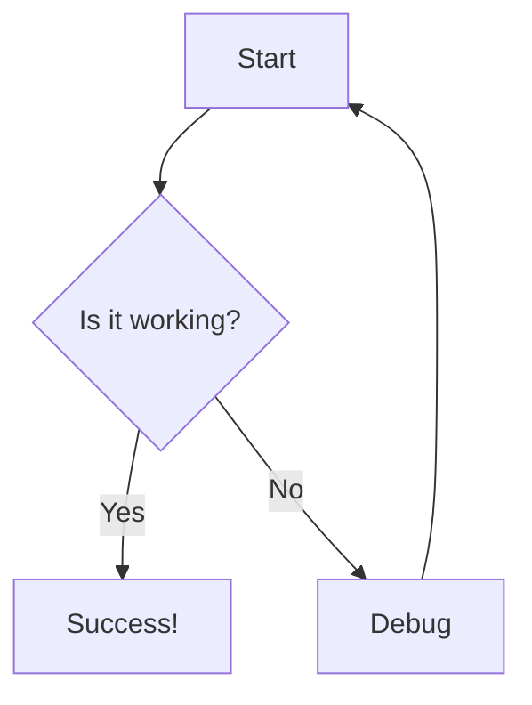
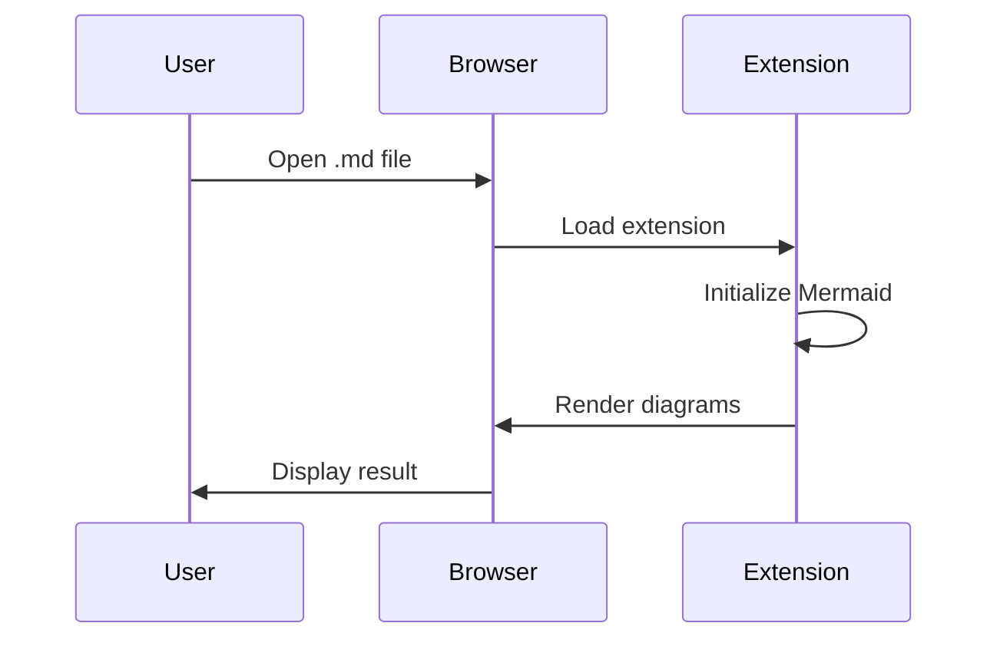
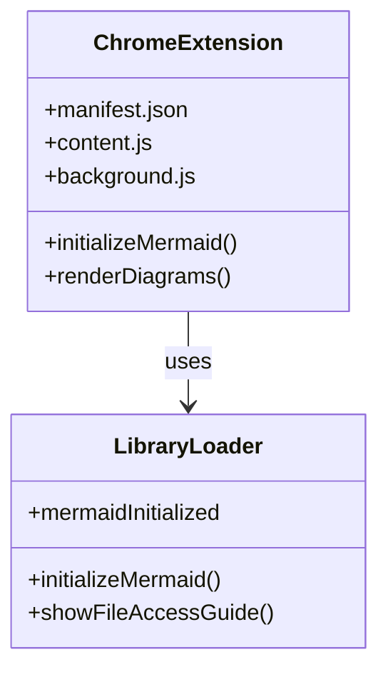

# Mermaid Test Document

This document tests the Mermaid functionality after the Chrome extension bug fixes.

## Basic Flowchart

## Sequence Diagram

## Class Diagram

## Test Status

- ✅ Mermaid library loaded via manifest.json (not dynamic loading)
- ✅ Removed problematic dynamic script injection
- ✅ Fixed file access permission issues
- ✅ Chrome Web Store compliance improvements
- ✅ Removed unnecessary 'management' permission

## Expected Behavior

1. Open this file in Chrome with the extension enabled
2. Mermaid diagrams should render automatically
3. No console errors should appear
4. File access permission guide should show if needed